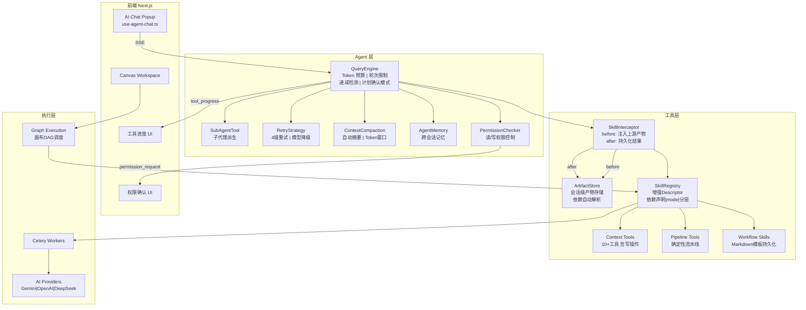

# Canvex Agent 系统升级规划 -- 融合 Claude Code + FireRed-OpenStoryline 精华

## 一、参考分析

### 当前 Canvex Agent 已有能力

- **对话引擎**: PydanticAI `Agent` + SSE 流式输出 ([agent_service.py](api/app/agent/agent_service.py), [sse_protocol.py](api/app/agent/sse_protocol.py))
- **工具系统**: `SkillRegistry` 统一注册/调用，`SkillToolset` 桥接到 PydanticAI ([skill_toolset.py](api/app/agent/skill_toolset.py))
- **异步执行**: Celery 队列 + poll 轮询 ([skill_task.py](api/app/tasks/skill_task.py), [registry.py](api/app/skills/registry.py))
- **上下文查询**: 4 个 context tools 按需查项目角色/场景/剧本/画布 ([context_tools.py](api/app/agent/context_tools.py))
- **确定性流水线**: episode pipeline (split -> screenplay -> plan -> detail) ([pipeline_tools.py](api/app/agent/pipeline_tools.py))
- **画布 DAG 调度**: 拓扑排序 + BatchExecution ([graph_execution_service.py](api/app/services/graph_execution_service.py))

### 两个参考系统的核心模式

#### Claude Code -- 通用 Agent 基础设施 (偏"引擎层")

- **QueryEngine**: `submitMessage -> query -> 工具分发`，含 Token 预算、成本跟踪、4 级重试、递减检测
- **Tool 接口**: 45+ 工具，每个带 `isReadOnly`/`isConcurrencySafe`/`isDestructive`/`maxResultSizeChars`/`checkPermissions` 标记
- **技能/插件 5 层扩展**: 打包技能 > 内置插件 > 目录技能 > MCP 技能 > 外部插件
- **状态管理**: 自研 Store + 50+ AppState 字段 + DeepImmutable
- **子代理 AgentTool**: 主 Agent 可派生独立子任务

#### FireRed-OpenStoryline -- 垂类创作 Agent (偏"领域层")

- **ToolInterceptor + ArtifactStore**: 工具调用前自动从 `ArtifactStore` 拉取上游节点结果注入参数，工具调用后自动持久化产物。Agent **不需要手动传递大块 JSON**
- **NodeMeta 依赖声明**: 每个节点声明 `require_prior_kind` + `default_require_prior_kind`，`NodeManager.check_excutable()` 自动检查前置依赖是否就绪，缺失时**递归执行**前置节点
- **Skill 三层分类**: WORKFLOW SKILL (主流程) / CAPABILITY SKILL (局部增强) / META SKILL (管理/创建 Skill)
- **"先列计划、用户确认、再执行"**: System prompt 强制 Agent 先输出执行计划等用户确认
- **单工具调用规则**: 每次只调一个工具，调用后向用户简报结果和下一步意图
- **mode 参数 (auto/skip/default)**: 每个节点支持 skip 模式让用户跳过步骤
- **Markdown Skill 持久化**: 用户可将完整剪辑 Workflow 保存为 Markdown Skill，换素材复用

## 二、差距分析与升级方案

以下按影响力排序:

### P0 -- 必做 (直接影响 Agent 可用性)

**1. QueryEngine + "先计划再执行" 模式**

来源: Claude Code `QueryEngine` + OpenStoryline `system.md` "先列计划并等待用户确认"

Canvex 当前直接用 `agent.iter()` 遍历，缺乏 Token 预算、轮次限制、递减检测。同时，对于复杂多步任务，Agent 应该先输出执行计划让用户确认后再执行 (OpenStoryline 的核心交互模式)。

**改造方案**: 新增 `query_engine.py`，包装 agentic loop:

```python
class QueryEngine:
    max_turns: int = 15
    max_budget_usd: float | None = None
    
    async def submit_message(self, prompt, deps, toolsets) -> AsyncGenerator[SSEEvent]:
        turns = 0
        total_tokens = 0
        diminishing_count = 0
        
        async with agent.iter(prompt, deps=deps, toolsets=toolsets) as run:
            async for node in run:
                yield from self._process_node(node)
                turns += 1
                if turns >= self.max_turns: break
                # 递减检测: 连续 3 次 <500 token 增量 -> 终止
                increment = run.usage().total_tokens - total_tokens
                if increment < 500:
                    diminishing_count += 1
                    if diminishing_count >= 3: break
                else:
                    diminishing_count = 0
                total_tokens = run.usage().total_tokens
```

System Prompt 增加策略指令 (借鉴 OpenStoryline):

- 明确的单步任务 -> 直接调用工具
- 复杂/多步任务 -> **先列计划、等用户确认、再逐步执行**
- 每次工具调用后向用户简报结果和下一步意图

**关键文件**: 新增 `api/app/agent/query_engine.py`，修改 `api/app/api/v1/agent.py`，修改 `api/app/agent/context_builder.py`

---

**2. ArtifactStore + ToolInterceptor -- 节点产物自动注入**

来源: OpenStoryline `ArtifactStore` + `ToolInterceptor.inject_media_content_before/save_media_content_after`

这是 OpenStoryline 最值得借鉴的设计。核心思想: **Agent 不需要在 prompt 中传递上游节点的大块 JSON 结果，而是由拦截器自动从 ArtifactStore 装配**。这大幅减少 token 消耗，避免 LLM 在传递中丢失/篡改数据。

**改造方案**: 新增 `artifact_store.py` + 增强 `SkillToolset`:

```python
class ArtifactStore:
    """会话级产物存储 -- 每个 Skill 执行后的结果自动落库。"""
    async def save(self, session_id, skill_name, artifact_id, data, summary) -> ArtifactMeta
    async def get_latest(self, session_id, skill_name) -> tuple[ArtifactMeta, dict] | None
    async def load(self, artifact_id) -> dict

class SkillInterceptor:
    """工具调用前后拦截器。"""
    @staticmethod
    async def before_call(skill_name, params, store, deps):
        """自动注入上游依赖节点的最新产物到 params。"""
        descriptor = registry.get_descriptor(skill_name)
        for dep_kind in descriptor.require_prior_kind:
            latest = await store.get_latest(deps.session_id, dep_kind)
            if latest: params[dep_kind] = latest.data
        return params
    
    @staticmethod
    async def after_call(skill_name, result, store, deps):
        """自动持久化工具执行结果。"""
        await store.save(deps.session_id, skill_name, result.artifact_id, result.data, result.summary)
```

**关键文件**: 新增 `api/app/agent/artifact_store.py`，修改 `api/app/agent/skill_toolset.py`

---

**3. SkillDescriptor 增强 -- NodeMeta 式依赖声明 + mode 参数**

来源: Claude Code 工具标记 + OpenStoryline `NodeMeta` + `mode` 参数

融合两者，扩展 `SkillDescriptor`:

```python
@dataclass
class SkillDescriptor:
    # ... 现有字段 ...
    
    # -- 来自 Claude Code --
    is_read_only: bool = False
    is_concurrent_safe: bool = False
    is_destructive: bool = False
    max_result_size_chars: int = 50000
    timeout: int = 120
    required_permissions: list[str] = field(default_factory=list)
    
    # -- 来自 OpenStoryline NodeMeta --
    skill_kind: str = ""                                    # 产物类别 (如 "script", "storyboard", "character")
    require_prior_kind: list[str] = field(default_factory=list)  # auto 模式依赖
    default_require_prior_kind: list[str] = field(default_factory=list)  # default/skip 模式依赖
    supports_skip: bool = False                             # 是否支持 skip 模式
    
    # -- Skill 分层 (来自 OpenStoryline) --
    skill_tier: str = "capability"  # "workflow" | "capability" | "meta"
```

`mode` 参数允许用户跳过某个步骤 (如"我不要配音" -> `generate_voiceover(mode="skip")`)，与 OpenStoryline 的模式一致。

**关键文件**: 修改 `api/app/skills/descriptor.py`

---

### P1 -- 高优 (显著提升体验)

**4. 上下文压缩 + 统一重试策略**

来源: Claude Code `compact` 命令 + `withRetry.ts`

**上下文压缩**: 长对话自动摘要旧消息。配合 ArtifactStore (大块数据已不在 prompt 中)，token 使用更可控。

**重试策略**: 统一 4 级策略 (前台交互/后台异步/模型降级/持久重试)。

**关键文件**: 新增 `api/app/agent/context_compaction.py`，新增 `api/app/agent/retry.py`

---

**5. 扩充 Context Tools + 写操作 + 权限控制**

来源: Claude Code `checkPermissions` + OpenStoryline 单工具调用规则

扩展到 10+:

- 读操作: `get_project_overview`, `get_episode_list`, `get_shots_for_episode`, `search_project_content`, `get_style_templates`
- 写操作: `update_shot_description`, `create_character`, `update_scene`

写操作引入权限确认 (借鉴 Claude Code):

```python
class PermissionMode(str, Enum):
    ASK = "ask"       # 每次询问用户
    AUTO = "auto"     # 只读自动，写操作询问
    BYPASS = "bypass"  # 全部自动 (高级用户)
```

通过 SSE `permission_request` 事件 + 前端确认 UI 实现。

**关键文件**: 扩展 `api/app/agent/context_tools.py`，修改 `api/app/agent/sse_protocol.py`

---

**6. 成本跟踪 + 流式工具进度**

来源: Claude Code `StoredCostState` + `renderToolUseProgressMessage`

- QueryEngine 集成 `CostTracker`，SSE `done` 事件附带 usage 信息
- SSE 新增 `tool_progress` 事件，异步 poll 时推送进度
- 前端展示工具执行进度条 + 累计 token 消耗

**关键文件**: 新增 `api/app/agent/cost_tracker.py`，修改 SSE 协议和前端 `use-agent-chat.ts`

---

### P2 -- 重要 (长期竞争力)

**7. 子代理 (Sub-Agent) 架构**

来源: Claude Code `AgentTool`

主 Agent 可派生子任务 (如"分析 5 个剧集的分镜数据"拆成 5 个并行子代理)。每个子代理有独立工具集、token 预算。

**关键文件**: 新增 `api/app/agent/sub_agent.py`

---

**8. 可复用 Workflow Skill 持久化**

来源: OpenStoryline `write_skills` + Markdown SKILL.md

允许用户将一次成功的多步创作流程保存为 "Workflow Skill":

- 保存: Agent 完成多步流程后，用户说"保存为模板" -> Agent 将步骤序列 + 参数模板写为 Markdown
- 复用: 下次用户选择已有 Workflow Skill -> 按模板执行，只需换素材/参数
- 存储: 项目级 `workflow_skills` 表或文件目录

这对短剧批量生产场景极有价值 (如"用同一套分镜模板批量生成不同剧集")。

**关键文件**: 新增 `api/app/agent/workflow_skill.py`

---

**9. 跨会话 Agent 记忆**

来源: OpenStoryline `ArtifactStore` 跨节点记忆 + Claude Code 会话恢复

- 维护用户/项目级偏好 (常用风格、角色命名习惯等)
- 检索增强: 从项目数据构建上下文摘要注入 system prompt

**关键文件**: 新增 `api/app/agent/memory.py`

---

## 三、整体架构升级图




## 四、两个参考系统的借鉴对照表


| 设计模式      | Claude Code                                     | OpenStoryline                                    | Canvex 当前            | 改造建议                          |
| --------- | ----------------------------------------------- | ------------------------------------------------ | -------------------- | ----------------------------- |
| 查询引擎      | QueryEngine (Token预算/递减检测/轮次/成本)                | 无独立引擎，靠 LangChain agent loop                     | 直接 agent.iter()      | **Phase 1**: 新增 QueryEngine   |
| 工具元数据     | isReadOnly/isDestructive/isConcurrencySafe      | NodeMeta (node_kind/require_prior_kind/priority) | SkillDescriptor 基础字段 | **Phase 3**: 融合两者             |
| 产物管理      | 无 (工具结果在消息流中)                                   | ArtifactStore + ToolInterceptor 自动注入             | 无                    | **Phase 2**: 新增 ArtifactStore |
| 依赖解析      | 无显式依赖                                           | check_excutable + 递归执行前置                         | pipeline_tools 硬编码链  | **Phase 2**: 声明式依赖            |
| Skill 分层  | 5层: bundled/builtin-plugin/skill-dir/MCP/plugin | 3层: WORKFLOW/CAPABILITY/META                     | 单层 SkillCategory     | **Phase 3**: 三层分类             |
| 执行模式      | 无                                               | mode: auto/skip/default                          | 无                    | **Phase 3**: Skill 支持 skip    |
| 计划确认      | 无 (但有 plan 权限模式)                                | "先列计划等确认再执行" 强制规则                                | 无                    | **Phase 1**: System Prompt 策略 |
| 单步工具      | 并行工具调用                                          | 强制单工具+每步简报                                       | 并行                   | **Phase 1**: 可配置策略            |
| Skill 持久化 | .claude/skills/ 目录 SKILL.md                     | .storyline/skills/ Markdown                      | 无                    | **Phase 8**: Workflow Skill   |
| 权限系统      | 7种模式+YOLO分类器+Hook                               | 无                                                | 无                    | **Phase 5**: 简化版 ask/auto     |
| 上下文压缩     | /compact 命令                                     | 无 (ArtifactStore 减 token)                        | 无                    | **Phase 4**: 自动摘要             |
| 重试        | withRetry 4级策略                                  | 无                                                | pipeline 简单重试        | **Phase 4**: 统一重试             |
| 子代理       | AgentTool 子任务                                   | 无                                                | 无                    | **Phase 7**: SubAgentTool     |
| 跨会话记忆     | 会话恢复 + CLAUDE.md                                | ArtifactStore 持久化                                | DB 消息历史              | **Phase 9**: 偏好记忆             |


## 五、推荐实施顺序

- **Phase 1** (2-3天): QueryEngine + "先计划再执行" System Prompt 策略
- **Phase 2** (3天): ArtifactStore + ToolInterceptor 自动注入/持久化 **(来自 OpenStoryline 最核心借鉴)**
- **Phase 3** (2-3天): SkillDescriptor 增强 (依赖声明 + mode + 三层分类)
- **Phase 4** (2天): 上下文压缩 + 统一重试策略
- **Phase 5** (2-3天): 扩充 Context Tools + 写操作 + 权限控制
- **Phase 6** (2天): 成本跟踪 + SSE 工具进度事件
- **Phase 7** (2-3天): SubAgentTool 子代理架构
- **Phase 8** (2天): Workflow Skill 持久化 (Markdown 模板) **(来自 OpenStoryline 第二大借鉴)**
- **Phase 9** (2天): 跨会话 Agent 记忆

总计约 19-23 天，建议按 Phase 顺序渐进式交付。Phase 1-3 完成后 Agent 可用性会有质的飞跃。