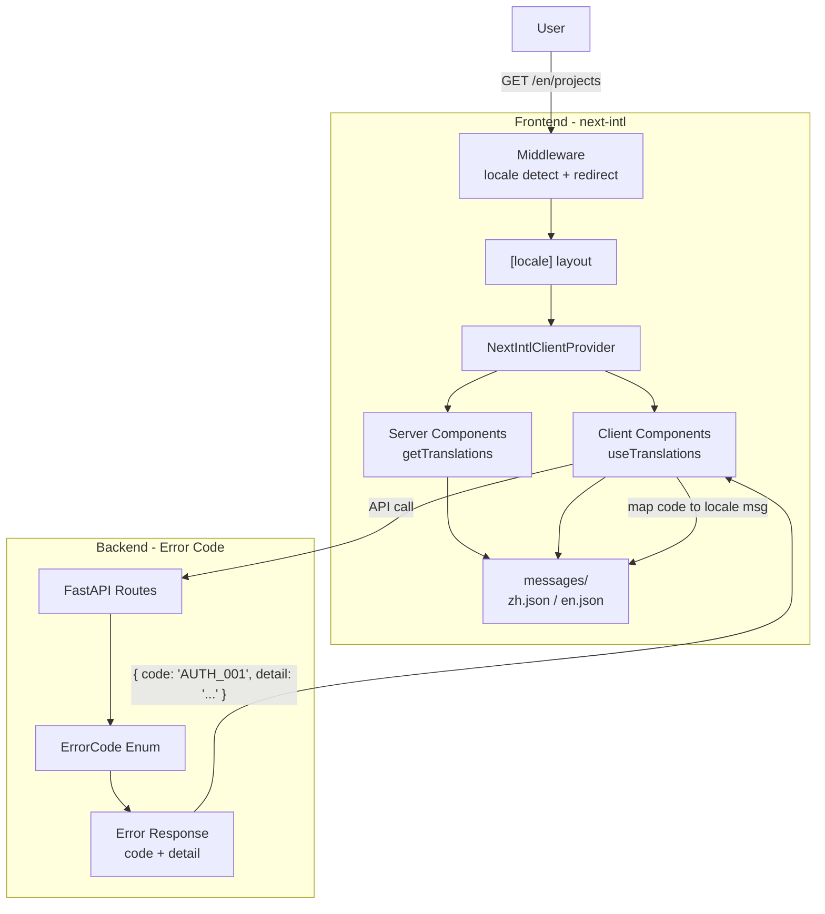

# Canvex i18n 国际化支持方案

## 现状分析

- **前端**: Next.js 16.2.1 (App Router), React 19, ~80 个 TS/TSX 文件, ~54 个文件含中文硬编码, 无任何 i18n 基础设施
- **后端**: FastAPI, 所有 HTTPException detail 为硬编码英文字符串, 无 error_code 体系
- **当前语言**: 中英混用 -- 导航/登录偏英文, 画布/计费/任务偏中文, `<html lang="zh">`

## 技术选型: next-intl

选择 `[next-intl](https://next-intl.dev/)` 作为前端 i18n 方案，理由：

- Next.js App Router 官方推荐方案之一，社区活跃度最高
- 原生支持 URL 前缀路由 (`/zh/...`, `/en/...`)
- 支持 Server Components + Client Components
- 支持 ICU MessageFormat（复数、日期、数字格式化）
- TypeScript 类型安全

## 整体架构




## 目录结构变更

```
web/
  src/
    app/
      [locale]/              # <-- 新增 locale 动态段
        layout.tsx           # <-- 从原 layout.tsx 迁移
        page.tsx
        (auth)/
          layout.tsx
          login/page.tsx
          register/page.tsx
        invite/[token]/page.tsx
        projects/...
        canvas/...
        teams/...
        settings/...
        tasks/page.tsx
        billing/page.tsx
      layout.tsx             # <-- 新的根 layout（极简，不含 locale 逻辑）
    i18n/
      request.ts             # next-intl Server 端配置
      routing.ts             # 路由配置（locales, defaultLocale）
    middleware.ts             # locale 检测 + 重定向
  messages/
    zh.json                  # 中文翻译文件（源语言）
    en.json                  # 英文翻译文件
```

## Phase 1: 基础设施搭建

### 1.1 安装依赖

```bash
cd web && npm install next-intl
```

### 1.2 创建路由配置 `src/i18n/routing.ts`

```typescript
import { defineRouting } from 'next-intl/routing';

export const routing = defineRouting({
  locales: ['zh', 'en'],
  defaultLocale: 'zh',
});
```

### 1.3 创建 Server 端请求配置 `src/i18n/request.ts`

```typescript
import { getRequestConfig } from 'next-intl/server';
import { routing } from './routing';

export default getRequestConfig(async ({ requestLocale }) => {
  let locale = await requestLocale;
  if (!locale || !routing.locales.includes(locale as any)) {
    locale = routing.defaultLocale;
  }
  return {
    locale,
    messages: (await import(`../../messages/${locale}.json`)).default,
  };
});
```

### 1.4 创建 Middleware `src/middleware.ts`

```typescript
import createMiddleware from 'next-intl/middleware';
import { routing } from './i18n/routing';

export default createMiddleware(routing);

export const config = {
  matcher: ['/((?!api|_next|.*\\..*).*)'],
};
```

### 1.5 重构 App Router 目录

- 创建 `src/app/[locale]/` 目录
- 将所有现有页面和布局移入 `[locale]/` 下
- 根 `layout.tsx` 简化为最小 HTML shell
- `[locale]/layout.tsx` 包裹 `NextIntlClientProvider`，动态设置 `<html lang={locale}>`

### 1.6 初始化翻译文件

创建 `messages/zh.json` 和 `messages/en.json`，按功能模块组织 namespace：

```json
{
  "common": {
    "loading": "加载中...",
    "save": "保存",
    "cancel": "取消",
    "delete": "删除",
    "confirm": "确认",
    "search": "搜索",
    "back": "返回"
  },
  "nav": {
    "projects": "项目",
    "teams": "团队与角色",
    "aiConsole": "AI 控制台",
    "tasks": "任务",
    "billing": "计费",
    "settings": "设置"
  },
  "auth": {
    "login": "登录",
    "register": "注册",
    "email": "邮箱",
    "password": "密码",
    "loginFailed": "登录失败",
    "emailRequired": "请输入邮箱",
    "passwordRequired": "请输入密码"
  },
  "errors": {
    "AUTH_001": "邮箱已注册",
    "AUTH_002": "邮箱或密码错误",
    "AUTH_003": "账号已被封禁",
    "GENERIC": "操作失败，请稍后重试"
  }
}
```

## Phase 2: 核心页面迁移

按优先级迁移硬编码字符串：

### 2.1 布局与导航

- `app-shell.tsx` / `sidebar.tsx` / `topbar.tsx` -- 导航项、空间标签、用户菜单
- 使用 `useTranslations('nav')` 替换硬编码

### 2.2 认证页面

- `login/page.tsx` / `register/page.tsx` -- 表单标签、按钮、错误提示
- `invite/[token]/page.tsx` -- 邀请相关文案

### 2.3 语言切换器组件

- 创建 `LanguageSwitcher` 组件，放在 topbar 或 sidebar
- 使用 `next-intl` 的 `useRouter` + `usePathname` 实现无刷新切换

### 2.4 Link 和导航适配

- 使用 `next-intl` 提供的 `Link` / `useRouter` / `redirect` 替换 Next.js 原生版本
- 创建 `src/i18n/navigation.ts`:

```typescript
import { createNavigation } from 'next-intl/navigation';
import { routing } from './routing';

export const { Link, redirect, usePathname, useRouter } =
  createNavigation(routing);
```

## Phase 3: 功能页面迁移

### 3.1 项目模块

- `projects/page.tsx` / `projects/[id]/page.tsx` -- 项目列表/详情文案

### 3.2 画布模块

- `canvas-toolbar.tsx` -- 节点类型名称（「文本输入」「LLM 生成」等）
- `canvas-workspace.tsx` / 各 node 组件 -- 操作提示

### 3.3 团队模块

- `teams/page.tsx` / `teams/[id]/page.tsx` -- 成员管理、邀请相关

### 3.4 计费/任务/设置

- `billing-dashboard.tsx` -- 日期预设、KPI 标签
- `tasks/page.tsx` -- 任务状态
- `settings/page.tsx` -- 配置项标签

### 3.5 Chat 模块

- `chat/` 下约 9 个文件 -- 对话 UI 文案

## Phase 4: 后端 Error Code 体系

### 4.1 定义错误码枚举

在 `api/app/core/error_codes.py` 中：

```python
from enum import Enum

class ErrorCode(str, Enum):
    AUTH_EMAIL_EXISTS = "AUTH_001"
    AUTH_INVALID_CREDENTIALS = "AUTH_002"
    AUTH_ACCOUNT_BANNED = "AUTH_003"
    AUTH_INVALID_TOKEN = "AUTH_004"
    AUTH_TOKEN_EXPIRED = "AUTH_005"
    TEAM_NOT_FOUND = "TEAM_001"
    TEAM_ACCESS_DENIED = "TEAM_002"
    PROJECT_NOT_FOUND = "PROJECT_001"
    PROJECT_ACCESS_DENIED = "PROJECT_002"
    CANVAS_SELF_LOOP = "CANVAS_001"
    # ...
```

### 4.2 统一错误响应格式

修改 `HTTPException` 调用，返回结构化 JSON:

```python
# Before
raise HTTPException(status_code=400, detail="Email already registered")

# After
raise HTTPException(
    status_code=400,
    detail={"code": ErrorCode.AUTH_EMAIL_EXISTS, "message": "Email already registered"}
)
```

### 4.3 前端错误处理适配

在 `web/src/lib/api.ts` 的 Axios 拦截器中，解析 `error.response.data.detail.code`，通过 `t(`errors.${code}`)` 获取翻译后的错误消息。

## Phase 5: 收尾与优化

- 日期/数字格式化：使用 `next-intl` 的 `useFormatter` 替代手动格式化
- Metadata i18n：使用 `getTranslations` 在 `generateMetadata` 中动态生成页面标题/描述
- 字体适配：中文场景考虑添加中文 web font 子集或 `system-ui` fallback
- CI 检查：可选添加翻译文件完整性检查脚本（确保 zh.json 和 en.json key 一致）

## 工作量估算


| 阶段                     | 涉及文件数     | 预计工时 |
| ---------------------- | --------- | ---- |
| Phase 1: 基础设施          | ~8 个新建/改动 | 中    |
| Phase 2: 核心页面          | ~10 个组件   | 中    |
| Phase 3: 功能页面          | ~40 个组件   | 大    |
| Phase 4: 后端 Error Code | ~15 个文件   | 中    |
| Phase 5: 收尾            | ~5 个文件    | 小    |


建议分批实施，Phase 1 + 2 先落地可验证完整链路，再逐步铺开 Phase 3-5。