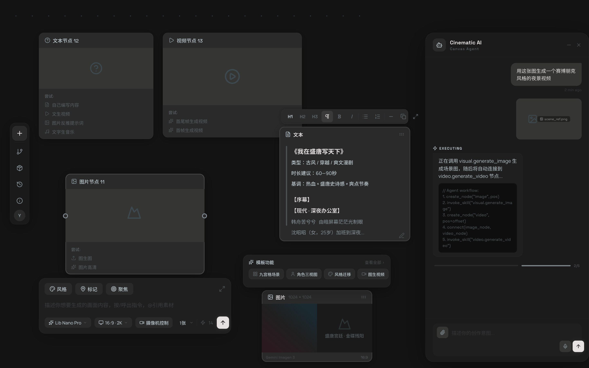
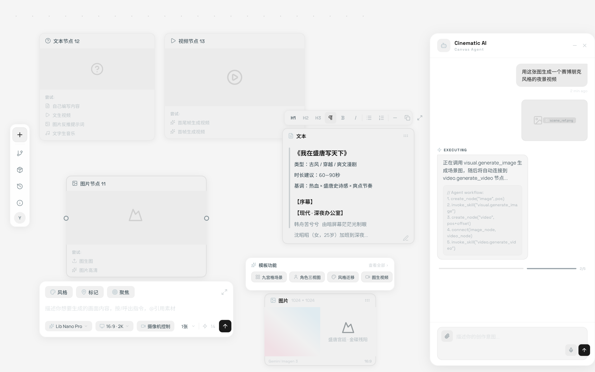

# Canvas 节点系统重构设计文档

> Phase 04+ 核心设计 — 极简素材节点、聚焦交互、模板系统、资产库
> Created: 2026-03-29 | Updated: 2026-03-29

## 设计稿

### 深色模式 (Dark Mode)



### 浅色模式 (Light Mode)



> 源文件: `pencil-new.pen`（Pencil MCP 格式）
> - 深色版 Frame: `GVXke` (V4 Minimal Canvas)
> - 浅色版 Frame: `Pm52C` (V4 Light Mode)

### AI 可读规格文件

| 文件 | 用途 | 格式 |
|------|------|------|
| [design-tokens.json](designs/design-tokens.json) | 双主题颜色/间距/字体/图标变量 | JSON (可直接转 CSS Variables / Tailwind) |
| [component-specs.md](designs/component-specs.md) | 每个组件的精确尺寸/布局/层级规格 | Markdown (YAML 代码块) |

> **给 AI 编码时**: 将 `design-tokens.json` + `component-specs.md` 作为上下文提供，比截图精度高 10 倍。

---

## 一、设计目标

将当前 5 类功能单一的节点（text-input / llm-generate / extract / image-gen / output）**精简为 4 类基础素材节点**，每个节点只保留极简的内容展示区，所有 AI 生成和模板功能通过**聚焦交互**触发。

### 核心原则

1. **极简节点**：节点卡片只展示内容（文本/图片/视频/音频），不内嵌复杂的 AI 生成面板
2. **聚焦触发**：点击/聚焦节点时弹出浮动操作面板 — 空节点在**下方**弹出 AI 生成对话框，有内容的节点在**上方**弹出功能菜单（文本节点弹出编辑工具栏，其他类型弹出模板功能菜单）
3. **取消右键**：所有功能通过聚焦弹出面板触发，不再使用右键上下文菜单
4. **左侧悬浮菜单**：画布工具栏从顶栏改为左侧悬浮圆角浮动条
5. **智能串联**：上游输出自动适配下游输入，提示词按 `[下游节点描述] + [上游输入]` 拼接
6. **模板驱动**：已注册的 Skill 作为节点功能模板，聚焦有内容节点时展示

---

## 二、画布布局

### 2.1 左侧悬浮菜单

参考图1样式，极简圆角浮动工具栏，悬浮在画布左侧中央区域。

```
     ┌──────┐
     │  ＋  │  ← 新建节点（弹出节点类型选择）
     ├──────┤
     │  🔗  │  ← 分支/工作流视图
     ├──────┤
     │  📦  │  ← 资产库面板
     ├──────┤
     │  ⏱  │  ← 历史/版本
     ├──────┤
     │  ❓  │  ← 帮助
     ├──────┤
     │  👤  │  ← 用户头像
     └──────┘
```

**交互：**
- 悬浮在画布左侧，不占用画布空间
- `+` 按钮点击后弹出节点类型选择浮层：文本 / 图片 / 视频 / 音频
- 点击后在画布视口中心创建对应空节点
- 其他按钮控制侧边面板开关

### 2.2 顶部导航栏

保留 Stitch 参考的顶部导航结构：

```
┌──────────────────────────────────────────────────────────┐
│ Obsidian Canvas   Scenes  Assets  Timeline   ⚙ 🔔  Share  Export │
└──────────────────────────────────────────────────────────┘
```

### 2.3 AI 聊天弹出框（Canvas Agent）

浮动圆角弹出框（非固定侧栏），悬浮在画布右侧，可收起/关闭/拖拽。

```
┌──────────────────────────────────────┐
│  🤖 Cinematic AI            [−] [×] │
│      Canvas Agent                    │
├──────────────────────────────────────┤
│                                      │
│        用这张图生成一个赛博朋克  ← 用户 │
│        风格的夜景视频                 │
│                     [scene_ref.png]  │
│                                      │
│  ⚡ EXECUTING                         │
│  正在调用 visual.generate_image      │
│  生成场景图，随后将自动连接到         │
│  video.generate_video 节点...         │
│  ┌──────────────────────────────┐    │
│  │ // Agent workflow:            │    │
│  │ 1. create_node("image", pos)  │    │
│  │ 2. invoke_skill(...)          │    │
│  │ 3. create_node("video", ...)  │    │
│  │ 4. connect(image, video)      │    │
│  │ 5. invoke_skill(...)          │    │
│  └──────────────────────────────┘    │
│  ████████░░░░░░░░░░░░  2/5           │
│                                      │
├──────────────────────────────────────┤
│  ┌──────────────────────────── ──┐   │
│  │ [📎] 描述你的创作意图...       │   │
│  │                      [🎤] [↑] │   │
│  └──────────────────────────────┘   │
└──────────────────────────────────────┘
```

**布局：**
- 输入框左上角：📎 附件/图片上传按钮
- 输入框右下角：🎤 语音按钮 + ↑ 发送按钮（青蓝渐变）

**核心功能：**
- **自然语言意图** — 用户用自然语言描述创作需求，Agent 自动分解为多步工作流
- **媒体上传** — 输入框左上角 📎 按钮上传图片/视频/音频作为参考素材
- **语音输入** — 输入框右下角 🎤 按钮语音输入
- **Agent 工具调用** — Agent 根据意图调用 Skills 操作画布：
  - `create_node(type, position)` — 创建节点
  - `invoke_skill(skill_name, params)` — 调用 Skill 生成内容
  - `connect(source, target)` — 连接节点
  - `update_node(id, config)` — 更新节点配置
  - `delete_node(id)` — 删除节点
- **执行进度** — 显示多步工作流的执行进度（如 2/5 步骤）
- **代码块展示** — 显示 Agent 正在执行的工作流步骤

---

## 三、节点类型体系

### 3.1 四类素材节点（极简设计）

所有节点共享统一的极简外壳：

```
┌──────────────────────────┐
│ 📝 文本节点 12            │  ← 类型图标 + 标题
├──────────────────────────┤
│                          │
│   [内容预览区]            │  ← 文本/图片/视频/音频的预览
│   （空节点显示占位图标）   │
│                          │
├──────────────────────────┤
│ 尝试:                    │  ← 功能提示区（静态展示）
│ 📝 自己编写内容           │
│ ▶ 文生视频               │
│ 🖼 图片反推提示词         │
│ 🎵 文字生音乐            │
└──────────────────────────┘
```

**设计要点（参考图2）：**
- 节点宽度固定 ~280px
- 深色背景卡片 `#2A2A2A`，圆角 12px
- 内容预览区占据节点上半部，空节点显示对应类型的灰色占位图标
- 下方"尝试"区域以小字体列出该节点可用的功能/模板名称，作为引导
- 左右两侧有 `⊕` 连接点（Handle），hover 时显示

---

### 3.2 各节点类型详情

#### 文本节点 (text)

| 属性 | 值 |
|------|-----|
| 图标 | 📝（三横线文本图标） |
| 内容预览 | 文本内容的前几行，Markdown 简易渲染 |
| 空节点占位 | 三横线文本占位图标 |
| 功能提示 | 自己编写内容 / 文生视频 / 图片反推提示词 / 文字生音乐 |
| 输出类型 | text |

#### 图片节点 (image)

| 属性 | 值 |
|------|-----|
| 图标 | 🖼（山水图片图标） |
| 内容预览 | 图片缩略图 |
| 空节点占位 | 山水图片占位图标 |
| 功能提示 | 图生图 / 图片高清 |
| 输出类型 | image |

#### 视频节点 (video)

| 属性 | 值 |
|------|-----|
| 图标 | ▶（播放图标） |
| 内容预览 | 视频缩略图 + 播放按钮覆盖 |
| 空节点占位 | 播放按钮占位图标 |
| 功能提示 | 首尾帧生成视频 / 首帧生成视频 |
| 输出类型 | video |

#### 音频节点 (audio)

| 属性 | 值 |
|------|-----|
| 图标 | 🎵（音符图标） |
| 内容预览 | 音频波形 + 播放控件 |
| 空节点占位 | 音符占位图标 |
| 功能提示 | (预留) |
| 输出类型 | audio |

### 3.3 取消的节点类型

以下旧节点类型不再作为独立节点存在：

| 旧类型 | 处理方式 |
|--------|---------|
| `text-input` | 合并为 `text` 节点 |
| `llm-generate` | 功能集成到文本节点的聚焦面板 |
| `image-gen` | 功能集成到图片节点的聚焦面板 |
| `extract` | 转为文本/图片节点的模板功能 |
| `output` | 取消独立输出节点，每个节点自身就是输出 |
| `prompt-input` | 合并为 `text` 节点 |
| `ai-image-process` | 功能集成到图片节点的模板 |
| `ai-text-generate` | 功能集成到文本节点的聚焦面板 |
| `source-image` | 合并为 `image` 节点 |
| `source-text` | 合并为 `text` 节点 |

---

## 四、聚焦交互系统（核心）

### 4.1 交互规则

当用户**点击/聚焦**一个节点时，根据节点内容状态弹出不同的浮动面板：

| 节点状态 | 弹出方向 | 弹出内容 | 参考 |
|---------|---------|---------|------|
| **空节点（无内容）** | **节点下方 ↓** | AI 生成对话框 | 设计图3 |
| **有内容的文本节点** | **节点上方 ↑** | 文本编辑工具栏 | 设计图 TextToolbar |
| **有内容的图片/视频/音频节点** | **节点上方 ↑** | 模板功能菜单 | 设计图 TemplateMenu |

> **设计原理**：有内容时功能菜单在上方，因为用户视线自然从节点内容向上找操作入口；空节点时 AI 面板在下方，因为"生成"是向下创造新内容的方向，且不遮挡节点本身的占位提示信息。

### 4.2 空节点 → AI 生成对话框（节点下方 ↓）

当节点没有内容时，聚焦后在**节点下方**弹出 AI 生成面板：

```
┌──────────────────────────────────────────────────┐
│  [⊕] 图片节点 11                           [⊕]  │
│  ┌──────────────────────────────────────────┐    │
│  │                                          │    │
│  │          🖼 （占位图标）                   │    │
│  │                                          │    │
│  │  尝试:                                   │    │
│  │  ↑ 图生图                                │    │
│  │  HD 图片高清                              │    │
│  └──────────────────────────────────────────┘    │
└──────────────────────────────────────────────────┘
          │ （连接指示线）
          ↓ （聚焦后在下方弹出）
┌──────────────────────────────────────────────────────┐
│  ┌──────┐ ┌──────┐ ┌──────┐                    [↗] │
│  │ 🎨   │ │ 📍   │ │ 🎯   │                         │
│  │ 风格  │ │ 标记  │ │ 聚焦  │                         │
│  └──────┘ └──────┘ └──────┘                         │
│                                                      │
│  描述你想要生成的画面内容，按/呼出指令，@引用素材       │
│                                                      │
│                                                      │
│  ┌─────────────┐ ┌───────────┐ ┌──────────┐        │
│  │ 🎬 模型选择  │ │ 📐 16:9·2K│ │ 📷 摄像机 │  1张▾  │
│  └─────────────┘ └───────────┘ └──────────┘  ⚡14 ↑│
└──────────────────────────────────────────────────────┘
```

**AI 生成对话框功能：**
- **快捷标签**：风格 / 标记 / 聚焦 — 快速插入对应的提示词片段
- **文本输入区**：描述生成内容，支持 `/` 指令和 `@` 引用资产
- **底栏参数**：
  - 模型选择（Provider → Model 联动）
  - 画幅比例 + 分辨率（图片/视频节点）
  - 摄像机控制（视频节点）
  - 生成数量（图片节点）
  - 积分/token 消耗显示
  - 发送/生成按钮
- **全屏展开**：右上角 `↗` 可展开为更大的编辑面板

**各节点类型的 AI 生成对话框差异：**

| 节点类型 | 特有参数 |
|---------|---------|
| 文本 | Provider / Model 选择 |
| 图片 | 画幅比例 / 分辨率 / 模型 / 生成数量 |
| 视频 | 模式（文生视频/图生视频/...) / 画幅 / 时长 / 摄像机控制 |
| 音频 | (预留) |

### 4.3 有内容的节点 → 功能菜单（节点上方 ↑）

当节点已有内容时，聚焦后在**节点上方**弹出功能面板。根据节点类型不同，弹出的面板也不同：

#### 4.3.1 文本节点 → 文本编辑工具栏

```
┌──────────────────────────────────────────┐
│ H1  H2  H3 [¶] B  I │ ≡  1. │ —  ⊡  ↗ │  ← 上方弹出工具栏
└──────────────────────────────────────────┘
          │ （连接指示线）
          ↓
┌──────────────────────────────────────────────────┐
│  📝 文本                                    ⠿   │
│  ┌──────────────────────────────────────────┐    │
│  │ ┃ 《我在盛唐写天下》                      │    │
│  │ ┃ 类型：古风 / 穿越 / 爽文漫剧            │    │
│  │ ┃ 时长建议：60—90秒                      │    │
│  │ ┃ 基调：热血 × 盛唐史诗感 × 爽点节奏      │    │
│  │ ┃                                        │    │
│  │ ┃ 【序幕】                                │    │
│  │ ┃ 【现代 · 深夜办公室】                   │    │
│  └──────────────────────────────────────────┘ ✏️ │
└──────────────────────────────────────────────────┘
```

工具栏按钮：H1/H2/H3/段落(¶)/加粗(B)/斜体(I) | 列表/有序列表 | 分割线/复制/全屏

#### 4.3.2 图片/视频/音频节点 → 模板功能菜单

```
┌──────────────────────────────────────────────────┐
│ ✨ 模板功能                         查看全部 ›   │
│ ┌──────────┐ ┌──────────┐ ┌────────┐ ┌────────┐│
│ │ ⊞ 九宫格  │ │ 👤 三视图 │ │ 🎨 风格 │ │ ▶ 视频 ││
│ │   场景    │ │   角色    │ │  迁移   │ │ 图生   ││
│ └──────────┘ └──────────┘ └────────┘ └────────┘│
└──────────────────────────────────────────────────┘
          │ （连接指示线）
          ↓
┌──────────────────────────────────────────────────┐
│  🖼 图片   1024×1024                        ⠿   │
│  ┌──────────────────────────────────────────┐    │
│  │          [生成的图片预览]                  │    │
│  └──────────────────────────────────────────┘    │
│  Gemini Imagen 3                          16:9  │
└──────────────────────────────────────────────────┘
```

**模板操作的行为：**
- 点击模板项 → 自动在当前节点下游创建新的素材节点
- 新节点预填配置（隐性提示词 + 参数）
- 自动建立连线
- 用户可直接在新节点的聚焦面板中点击生成

---

## 五、模板系统

### 5.1 模板定义

模板是预定义的"当前节点 → 下游节点"工作流配方：

```python
@dataclass
class NodeTemplate:
    id: str
    name: str                      # "九宫格场景生成"
    description: str
    icon: str                      # 显示图标
    applicable_node_types: list[str]  # 可在哪些节点类型上触发
    applicable_when: str           # "has_content" | "empty" | "both"
    
    # 工作流定义
    downstream_nodes: list[TemplateDownstreamNode]

@dataclass
class TemplateDownstreamNode:
    node_type: str                 # "text" | "image" | "video" | "audio"
    offset_x: float                # 相对位置偏移
    offset_y: float
    config: dict                   # 预填配置
    hidden_prompt: str | None      # 隐性提示词
    auto_execute: bool = False     # 是否自动执行
```

### 5.2 各节点类型可用模板

#### 文本节点模板

| 模板名称 | 下游节点 | 说明 |
|---------|---------|------|
| 文生视频 | video 节点 | 文本作为视频描述 prompt |
| 图片反推提示词 | text 节点 | 使用 LLM 分析上游图片生成描述 |
| 文字生音乐 | audio 节点 | 文本描述生成音乐(预留) |
| 剧本分镜 | image 节点 ×N | 根据剧本自动拆分为多个分镜图片 |
| 角色提取 | text 节点 ×N | 从剧本中提取角色描述 |
| 场景提取 | text 节点 ×N | 从剧本中提取场景描述 |

#### 图片节点模板

| 模板名称 | 下游节点 | 说明 |
|---------|---------|------|
| 图生图 | image 节点 | 基于当前图片做变换 |
| 图片高清 | image 节点 | 超分辨率放大 |
| 九宫格场景 | image 节点 | 隐性 prompt 生成 3×3 不同角度 |
| 角色三视图 | image 节点 | 隐性 prompt 生成正/侧/背三视图 |
| 场景氛围变换 | image 节点 | 改变时间/天气/氛围 |
| 风格迁移 | image 节点 | 应用不同画风 |
| 图生视频 | video 节点 | 以当前图片为首帧生成视频 |
| 首尾帧生成视频 | video 节点 | 需要两张图片作为首尾帧 |

#### 视频节点模板

| 模板名称 | 下游节点 | 说明 |
|---------|---------|------|
| 首尾帧生成视频 | video 节点 | 扩展/重混视频 |
| 首帧生成视频 | video 节点 | 从视频首帧重新生成 |

#### 音频节点模板

| 模板名称 | 下游节点 | 说明 |
|---------|---------|------|
| (预留) | — | 后续支持 |

### 5.3 隐性提示词

模板的核心是**隐性提示词**，它不显示在用户界面上，但自动拼入生成请求：

```
final_prompt = [hidden_prompt] + "\n\n" + [下游节点自身描述] + "\n\n" + [上游节点内容]
```

**示例 — 九宫格场景：**
```
hidden_prompt = "Generate a 3x3 grid (9 panels) showing the same scene from 9 different 
camera angles and compositions. Include wide shot, medium shot, close-up, bird's eye view, 
low angle, dutch angle, over-the-shoulder, establishing shot, and detail shot."
```

用户看到的只是一个新的图片节点，点击生成即可。

---

## 六、数据流与提示词拼接

### 6.1 上游数据聚合

```typescript
interface UpstreamData {
  text: string[];
  imageUrl: string[];
  videoUrl: string[];
  audioUrl: string[];
}
```

### 6.2 提示词拼接规则

```
final_prompt = [下游节点自身描述] + "\n\n" + [上游文本(join "\n")]
```

如果有隐性提示词（模板创建的节点）：
```
final_prompt = [hidden_prompt] + "\n\n" + [节点自身描述] + "\n\n" + [上游文本]
```

### 6.3 多模态输入适配

| 当前节点 | 上游文本 | 上游图片 | 上游视频 |
|---------|---------|---------|---------|
| 文本 | → 拼入 prompt | → 多模态输入 | 忽略 |
| 图片 | → 拼入 prompt | → 参考图 | 忽略 |
| 视频 | → 拼入 prompt | → 首帧 | → 参考视频 |
| 音频 | → 拼入 prompt | 忽略 | 忽略 |

---

## 七、连线交互

### 7.1 拖拽释放创建节点

从节点 Handle 拖出连线 → 释放到空白区域 → 弹出兼容节点类型选择浮层。

### 7.2 兼容性矩阵

| 源节点 | 可连接的下游 |
|--------|------------|
| 文本 | 文本、图片、视频、音频 |
| 图片 | 图片、视频 |
| 视频 | 视频 |
| 音频 | 音频、视频 |

### 7.3 连线规则

```typescript
const NODE_IO: Record<string, { inputs: string[]; outputs: string[] }> = {
  text:  { inputs: ["text", "image"],          outputs: ["text"] },
  image: { inputs: ["text", "image"],          outputs: ["image"] },
  video: { inputs: ["text", "image", "video"], outputs: ["video"] },
  audio: { inputs: ["text", "audio"],          outputs: ["audio"] },
};
```

---

## 八、资产库系统

### 8.1 资产类型

| 类型 | 图标 | 内容 | 拖入画布创建 |
|------|------|------|------------|
| 人物资产 | 👤 | 角色图片 + 描述 | image 节点 |
| 场景资产 | 🏞 | 场景图片 + 描述 | image 节点 |
| 风格资产 | 🎨 | 风格描述文本 | text 节点 |
| 音效资产 | 🎵 | 音频文件 | audio 节点 |

### 8.2 入库方式

聚焦有内容的节点 → 弹出功能菜单 → 点击"保存到资产库" → 填写名称/标签 → 保存。

### 8.3 出库方式

左侧悬浮菜单点击 📦 资产库 → 打开侧边面板 → 拖拽资产到画布 → 自动创建预填节点。

---

## 九、后端改动

### 9.1 Skill 调整

| Skill | 状态 | 说明 |
|-------|------|------|
| `text.llm_generate` | 修改 | 参数名 `text` → `prompt`，支持 model 动态选择 |
| `visual.generate_image` | 修改 | 增加分辨率参数 |
| `video.generate_video` | **新增** | 对接 VideoGenerationService |
| `audio.generate` | **预留** | 暂不实现 |

### 9.2 新增 API

| 端点 | 方法 | 说明 |
|------|------|------|
| `/api/v1/canvas/assets` | GET/POST | 资产 CRUD |
| `/api/v1/canvas/assets/{id}` | GET/DELETE | 资产详情/删除 |
| `/api/v1/canvas/templates` | GET | 列出可用模板 |

### 9.3 Bug 修复

| Bug | 修复方案 |
|-----|---------|
| LLM 节点 `text` vs `prompt` | 前端参数名改为 `prompt` |
| `toFlowNode` 未映射 `config.text` | 从 config 提取到 data 顶层 |
| Provider `auto` 未处理 | 后端增加 auto fallback |

---

## 十、前端文件结构

```
web/src/components/canvas/
├── canvas-workspace.tsx          # 画布主容器
├── canvas-floating-toolbar.tsx   # 左侧悬浮菜单（新）
├── canvas-asset-panel.tsx        # 资产库侧边面板（新）
├── canvas-node-creation-menu.tsx # 连线释放节点选择浮层
├── save-asset-dialog.tsx         # 保存资产对话框
├── nodes/
│   ├── index.ts                  # 节点类型注册
│   ├── text-node.tsx             # 文本节点（极简卡片）
│   ├── image-node.tsx            # 图片节点（极简卡片）
│   ├── video-node.tsx            # 视频节点（极简卡片）
│   ├── audio-node.tsx            # 音频节点（极简卡片）
│   └── shared/
│       ├── node-shell.tsx        # 共享节点外壳
│       └── status-indicator.tsx  # 状态指示器
├── panels/
│   ├── ai-generate-panel.tsx     # AI 生成浮动面板（空节点聚焦时）
│   ├── template-action-panel.tsx # 模板功能面板（有内容聚焦时）
│   └── panel-host.tsx            # 面板定位/动画管理
├── hooks/
│   ├── use-node-execution.ts
│   ├── use-node-persistence.ts
│   ├── use-upstream-data.ts      # 增强
│   ├── use-prompt-builder.ts     # 新增
│   └── use-node-focus.ts         # 新增：聚焦状态管理
└── edges/
    └── custom-edge.tsx
```

---

## 十一、实施波次

### Wave 1：Bug 修复 + 基础设施

- [ ] 修复 `text` vs `prompt` 参数名
- [ ] 修复 `toFlowNode` 的 `config.text` 映射
- [ ] 修复 Provider "auto" fallback
- [ ] 提取共享 `node-shell.tsx`
- [ ] 增强 `useUpstreamData` 支持 video/audio URL

### Wave 2：极简素材节点 + 聚焦交互

- [ ] 四类极简素材节点（text/image/video/audio）
- [ ] `use-node-focus` hook — 聚焦状态管理
- [ ] AI 生成浮动面板（空节点聚焦）
- [ ] 模板功能面板（有内容聚焦）
- [ ] `use-prompt-builder` hook — 提示词拼接
- [ ] 连线规则更新
- [ ] 旧节点类型兼容映射

### Wave 3：左侧菜单 + 连线交互 + 资产库

- [ ] 左侧悬浮菜单组件
- [ ] 连线释放节点创建浮层
- [ ] 后端 `CanvasAsset` 模型 + CRUD API
- [ ] 资产库侧边面板
- [ ] 拖拽资产到画布
- [ ] 聚焦面板中"保存到资产库"

### Wave 4：模板系统

- [ ] 模板定义数据结构
- [ ] 模板功能面板展示可用模板
- [ ] 模板应用逻辑（创建下游节点 + 连线 + 隐性提示词）
- [ ] 内置模板实现

---

## 十二、向后兼容

### 旧节点类型映射

```typescript
export const nodeTypes: NodeTypes = {
  // 新类型
  text: TextNode,
  image: ImageNode,
  video: VideoNode,
  audio: AudioNode,
  // 旧类型兼容
  "text-input": TextNode,
  "llm-generate": TextNode,
  "image-gen": ImageNode,
  "extract": TextNode,
  "output": TextNode,        // 输出节点映射为文本节点
  "prompt-input": TextNode,
  "ai-image-process": ImageNode,
  "ai-text-generate": TextNode,
  "source-image": ImageNode,
  "source-text": TextNode,
};
```

---

## 附录 A：提示词拼接示例

**场景**：`文本节点(角色描述)` → `图片节点`

- 文本节点内容：`"李雪，25岁女性，短发，穿着黑色皮夹克，眼神坚毅"`
- 图片节点 AI 对话框输入：`"赛博朋克风格的城市夜景，角色站在霓虹灯下"`

最终 prompt：
```
赛博朋克风格的城市夜景，角色站在霓虹灯下

李雪，25岁女性，短发，穿着黑色皮夹克，眼神坚毅
```

**场景**：`图片节点(城市照片)` → 聚焦弹出模板 → 点击"九宫格场景"

自动创建下游图片节点，final prompt：
```
Generate a 3x3 grid (9 panels) showing the same scene from 9 different camera angles...

[上游图片作为参考图传入]
```
