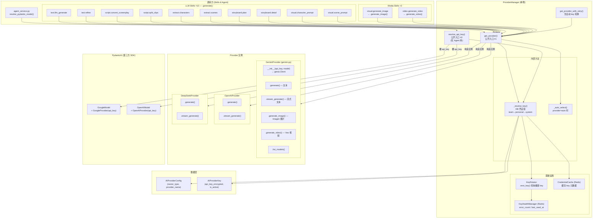

# AI 调用拓扑图 — 重构后全景

> Phase 12 最终架构文档。记录所有 AI 调用路径、类继承关系、方法签名。

## 调用拓扑 (Mermaid)



## 类继承与方法签名

```
AIProviderBase (ABC)                          ← base.py
└── LLMProviderBase (ABC)                     ← llm_provider_base.py
    ├── GeminiProvider                        ← gemini.py
    │   ├── __init__(api_key, model="gemini-2.5-flash")
    │   │   └── self.client = genai.Client(api_key=api_key)
    │   ├── generate(messages, temperature, max_tokens) → str
    │   ├── stream_generate(messages, ...) → AsyncGenerator[str]
    │   ├── generate_image(prompt, aspect_ratio, model, n) → dict       ★ 合并自 GeminiImageProvider
    │   ├── generate_video(prompt, image_bytes, ..., model) → dict      ★ 合并自 GeminiVideoProvider
    │   ├── list_models() → list[AIModelEntity]
    │   └── get_provider_entity() → ProviderEntity
    │
    ├── OpenAIProvider                        ← openai_provider.py
    │   ├── __init__(api_key, model="gpt-4o")
    │   ├── generate(messages, ...) → str
    │   ├── stream_generate(messages, ...) → AsyncGenerator[str]
    │   ├── list_models() → list[AIModelEntity]
    │   └── get_provider_entity() → ProviderEntity
    │
    └── DeepSeekProvider                      ← deepseek.py
        ├── __init__(api_key, model="deepseek-chat")
        ├── generate(messages, ...) → str
        ├── stream_generate(messages, ...) → AsyncGenerator[str]
        ├── list_models() → list[AIModelEntity]
        └── get_provider_entity() → ProviderEntity
```

```
ProviderManager (单例)                         ← provider_manager.py
├── get_provider(provider, model, *, team_id, user_id, db)
│   → (AIProviderBase, owner_desc, key_id)                   ✅ 公开入口 #1
├── get_provider_with_retry(provider, model, *, ..., max_retries)
│   → (AIProviderBase, owner_desc, key_id)                   ✅ 公开 (含 key 轮换)
├── resolve_api_key(provider, *, team_id, user_id, db)
│   → (api_key, owner_desc, key_id)                          ✅ 公开入口 #2 (仅 Agent)
├── _resolve_key(provider_name, team_id, user_id, db)
│   → (api_key, owner_desc, key_id)                          🔒 内部 — 凭证链
├── _auto_select(model, team_id, user_id, db)
│   → (AIProviderBase, owner_desc, key_id)                   🔒 内部 — provider=auto
├── get_configured_providers() → list[str]
└── get_all_provider_entities() → list[ProviderEntity]

KeyRotator                                     ← provider_manager.py
├── next_key(provider_name, keys) → key_obj
└── invalidate_pool(key_id)

KeyHealthManager (Redis)                       ← key_health.py
├── report_success(key_id)
├── report_error(key_id, error_type, message)
├── get_health(key_id) → dict
├── set_health(key_id, data)
└── reset_errors(key_id)

CredentialCache (Redis)                        ← credential_cache.py
├── get_cached(provider, chain) → dict | None
└── set_cached(provider, owner_type, owner_id, data)
```

## 调用路径总结

| 调用方 | 入口方法 | 拿到什么 | 最终调用 |
|---|---|---|---|
| 10 个 LLM Skill | `pm.get_provider("gemini")` | `GeminiProvider` 实例 | `.generate(messages)` |
| `visual.generate_image` | `pm.get_provider("gemini")` | `GeminiProvider` 实例 | `.generate_image(prompt, ...)` |
| `video.generate_video` | `pm.get_provider("gemini")` | `GeminiProvider` 实例 | `.generate_video(prompt, ...)` |
| `agent_service` (PydanticAI) | `pm.resolve_api_key("gemini")` | 裸 `api_key` 字符串 | `GoogleModel(model, GoogleProvider(api_key))` |

## 凭证解析链

```
_resolve_key(provider, team_id, user_id)
│
├─ 1. Redis CredentialCache 命中？
│     └─ 是 → DB 单行 SELECT by key_id → 解密 → 返回
│
├─ 2. DB 凭证链遍历 (team → personal → system)
│     ├─ AIProviderConfig WHERE owner_type + owner_id
│     ├─ KeyRotator.next_key() 选健康 key
│     │   └─ KeyHealthManager.get_health(key_id) — Redis 查询
│     ├─ 解密 api_key_encrypted (Fernet)
│     ├─ 写入 CredentialCache (仅元数据，不存明文 key)
│     └─ 返回 (api_key, owner_desc, key_id)
│
└─ 3. 全部未命中 → raise ValueError
```

## 已删除的旧代码

| 已删除 | 原因 |
|---|---|
| `gemini_image.py` / `GeminiImageProvider` | 合并入 `GeminiProvider.generate_image()` |
| `gemini_video.py` / `GeminiVideoProvider` | 合并入 `GeminiProvider.generate_video()` |
| `resolve_llm_provider()` (provider_manager.py) | 所有 skill 统一用 `pm.get_provider()` |
| `provider.api_key` 属性访问 | 不再暴露裸 key，Agent 走 `resolve_api_key()` |

## 文件索引

| 文件 | 角色 |
|---|---|
| `api/app/services/ai/base.py` | `AIProviderBase` 抽象基类 |
| `api/app/services/ai/llm_provider_base.py` | `LLMProviderBase` — LLM 公共抽象 |
| `api/app/services/ai/model_providers/gemini.py` | `GeminiProvider` — 统一文本/图片/视频 |
| `api/app/services/ai/model_providers/openai_provider.py` | `OpenAIProvider` |
| `api/app/services/ai/model_providers/deepseek.py` | `DeepSeekProvider` |
| `api/app/services/ai/provider_manager.py` | `ProviderManager` + `KeyRotator` + 生命周期函数 |
| `api/app/services/ai/key_health.py` | `KeyHealthManager` — Redis 健康状态 |
| `api/app/services/ai/credential_cache.py` | `CredentialCache` — Redis 凭证缓存 |
| `api/app/services/ai/errors.py` | `ContentBlockedError`, `TransientError` |
| `api/app/agent/agent_service.py` | `resolve_pydantic_model()` — PydanticAI 集成 |
| `api/app/skills/*/` | 12 个 Skill handler |
| `api/tests/test_provider_convergence.py` | 收敛集成测试 |
