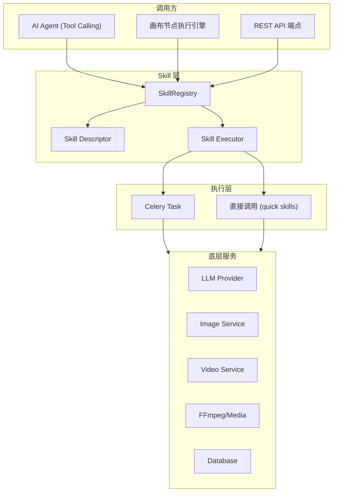
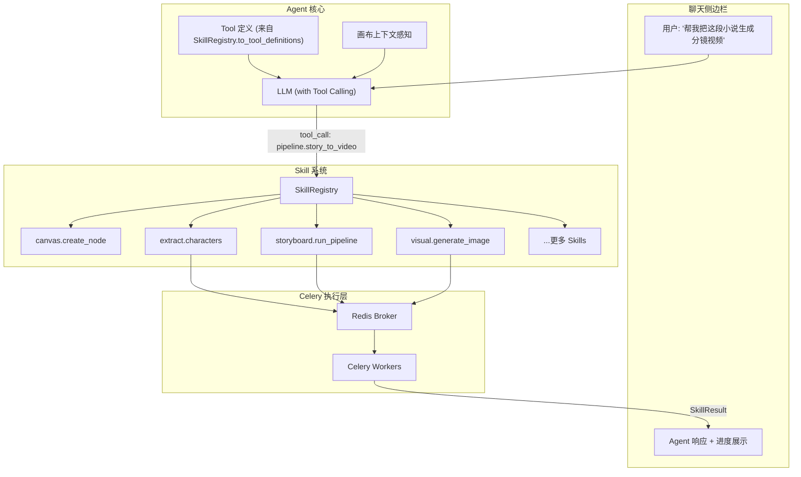
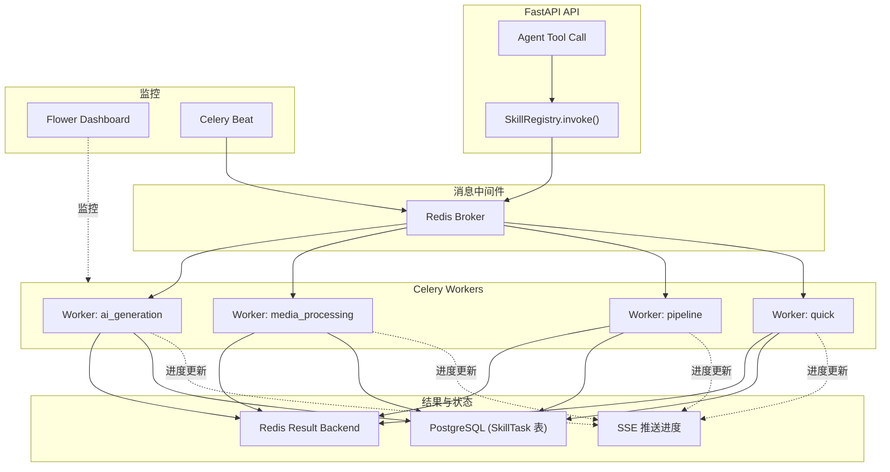
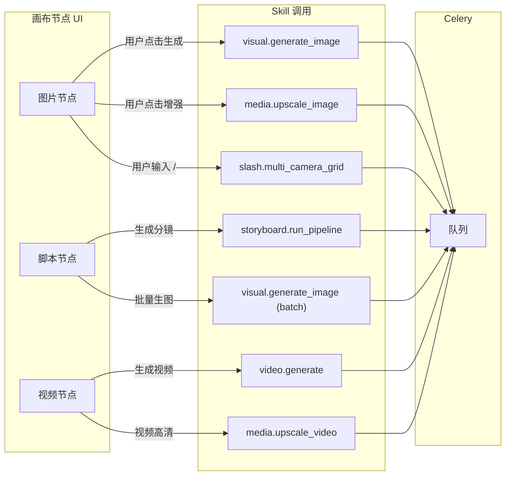
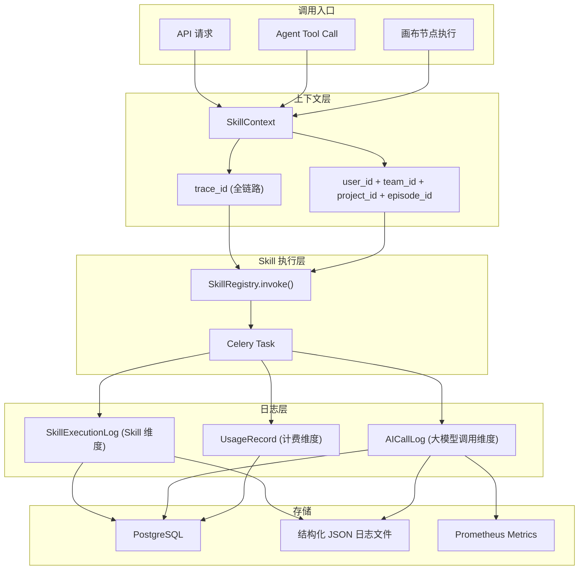
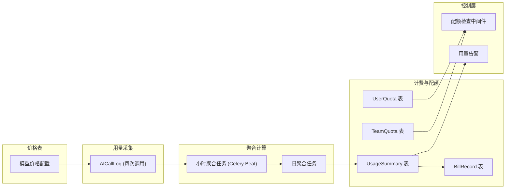

# Canvas Studio 重构方案 v2 -- 内部 Skill 体系 + Celery + Agent 编排

## 一、核心设计理念：参考 LibTV Skill 模式

### 1.1 LibTV Skill 的设计精髓

LibTV 通过 `libtv-skill/` 将平台能力封装为一组可被外部 Agent 调用的 Skills：

```
用户 → Agent(理解意图) → Skill(create_session/query/download) → LibTV平台(执行)
```

**关键设计模式：**

- **Skill = 可声明的能力单元**：每个 Skill 有 SKILL.md 描述名称、触发条件、输入/输出格式、使用方法
- **Agent 不做创作，只做编排**：Agent 的职责是理解用户意图 → 选择合适的 Skill → 调用 → 轮询 → 返回结果
- **异步生命周期**：`submit(提交) → poll(轮询进度) → result(获取结果)` 三段式
- **工作流 = Skill 的组合**：复杂任务是多个 Skill 按顺序/并行组合完成的

### 1.2 我们的内化方案

**把 LibTV 的模式内化到我们自己的系统中**：我们系统的每个核心能力（角色提取、分镜生成、图像生成、视频合成...）都封装为内部 Skill，系统内置的 AI Agent 通过 Tool Calling 协议调用这些 Skill，帮助用户在画布上完成操作。

```
用户 → 系统内 Agent(理解意图+画布感知) → SkillRegistry(发现+调用 Skill)
     → Celery(异步执行) → 画布节点(结果回写)
```

### 1.3 与原方案的核心差异

1. **Skill 体系替代裸 Atom** -- 不只是原子函数，而是带有完整描述、触发条件、输入输出约束、生命周期管理的 Skill 单元
2. **Agent-as-Orchestrator** -- Agent 不直接操作数据，而是通过 Skill 间接操作，Skill 内部封装所有业务细节
3. **企业级 Celery** -- 替换自建 Redis List + asyncio，Skill 的异步执行完全由 Celery 承载
4. **Skill 同时服务于画布节点和 Agent** -- 画布节点执行 = 调用 Skill，Agent tool calling = 调用 Skill，单一入口

---

## 二、Skill 体系设计

### 2.1 Skill 的三层结构




### 2.2 Skill Descriptor -- 参考 SKILL.md 格式

每个 Skill 有一份声明性描述 (Python dataclass)，供 Agent 自动发现和使用：

```python
@dataclass
class SkillDescriptor:
    name: str                    # "extract.characters"
    display_name: str            # "角色提取"
    description: str             # Agent 看到的功能描述 (用于 Tool Calling)
    triggers: list[str]          # 触发关键词 ["提取角色", "分析人物", "extract characters"]
    category: SkillCategory      # TEXT / EXTRACT / SCRIPT / STORYBOARD / VISUAL / MEDIA / AUDIO / PIPELINE
    input_schema: dict           # JSON Schema, 自动生成 Tool parameters
    output_schema: dict          # 输出格式描述
    execution_mode: str          # "sync" | "async_celery"
    celery_queue: str            # "ai_business" | "media_processing" | "pipeline" | "quick"
    estimated_duration: str      # "quick" (<10s) | "medium" (10s-2min) | "long" (>2min)
    requires_canvas: bool        # 是否需要画布上下文
    requires_project: bool       # 是否需要项目上下文
```

### 2.3 SkillRegistry -- 核心注册表

```python
class SkillRegistry:
    """Skill 注册表 -- 统一入口，Agent/节点/API 都通过它调用 Skill"""

    def register(self, descriptor: SkillDescriptor, handler: Callable) -> None:
        """注册一个 Skill"""

    def get(self, name: str) -> tuple[SkillDescriptor, Callable]:
        """按名称获取"""

    def discover(self, category: str = None) -> list[SkillDescriptor]:
        """发现可用 Skills (Agent 用于生成 Tool 定义)"""

    def to_tool_definitions(self, category: str = None) -> list[dict]:
        """将 Skills 转换为 OpenAI Tool Calling 格式的 function 定义"""

    async def invoke(self, name: str, params: dict, context: SkillContext) -> SkillResult:
        """
        统一调用入口:
        - sync skill: 直接 await handler(params, context)
        - async skill: submit to Celery, return task_id
        """

    async def poll(self, task_id: str) -> SkillResult:
        """查询异步 Skill 执行进度 (参考 libtv-skill 的 query_session 模式)"""
```

### 2.4 SkillResult -- 统一结果格式

```python
@dataclass
class SkillResult:
    status: str          # "completed" | "running" | "failed" | "queued"
    task_id: str | None  # Celery task ID (async skills)
    data: dict           # 结果数据 (视具体 Skill 而定)
    artifacts: list      # 生成的文件/资产 [{"type": "image", "url": "...", "node_id": "..."}]
    message: str         # 人类可读的状态描述 (Agent 可直接展示给用户)
    progress: float      # 0.0 ~ 1.0 进度 (async skills)
```

---

## 三、完整 Skill 清单

从现有 [api/app/services/ai/business/](api/app/services/ai/business/) 和 [api/app/services/](api/app/services/) 抽取，按功能分类：

### 3.1 文本处理 Skills (TEXT)


| Skill 名称               | 来源                                    | 执行模式  | 说明          |
| ---------------------- | ------------------------------------- | ----- | ----------- |
| `text.refine`          | `TextWorkshopService.refine_text`     | async | 文本润色/洗文     |
| `text.divide_episodes` | `TextWorkshopService.divide_episodes` | async | 文本分集        |
| `text.extract_climax`  | `TextWorkshopService.extract_climax`  | async | 提取高潮段落      |
| `text.llm_generate`    | `ProviderManager + LLM`               | async | 通用 LLM 文本生成 |


### 3.2 资产提取 Skills (EXTRACT)


| Skill 名称                   | 来源                                                | 执行模式  | 说明        |
| -------------------------- | ------------------------------------------------- | ----- | --------- |
| `extract.characters`       | `CharacterService.extract_characters`             | async | 从文本提取角色列表 |
| `extract.scenes`           | `SceneService.extract_scenes`                     | async | 从文本提取场景列表 |
| `extract.props`            | `StoryToScriptService.extract_props`              | async | 提取道具列表    |
| `extract.style_from_image` | `StyleGenerationService.extract_style_from_image` | async | 从图片提取风格   |
| `extract.style_from_video` | `StyleGenerationService.extract_style_from_video` | async | 从视频提取风格   |


### 3.3 剧本流水线 Skills (SCRIPT)


| Skill 名称                    | 来源                                        | 执行模式  | 说明        |
| --------------------------- | ----------------------------------------- | ----- | --------- |
| `script.split_clips`        | `StoryToScriptService.split_clips`        | async | 文本切分为片段   |
| `script.convert_screenplay` | `StoryToScriptService.convert_screenplay` | async | 片段转结构化剧本  |
| `script.run_pipeline`       | `StoryToScriptService.run_pipeline`       | async | 完整剧本转换流水线 |


### 3.4 分镜生成 Skills (STORYBOARD)


| Skill 名称                     | 来源                                                 | 执行模式  | 说明              |
| ---------------------------- | -------------------------------------------------- | ----- | --------------- |
| `storyboard.plan`            | `ScriptToStoryboardService.phase1_storyboard_plan` | async | Phase1: 分镜规划    |
| `storyboard.cinematographer` | `phase2a_cinematographer`                          | async | Phase2a: 镜头语言设计 |
| `storyboard.acting`          | `phase2b_acting_direction`                         | async | Phase2b: 表演指导   |
| `storyboard.detail`          | `phase3_storyboard_detail`                         | async | Phase3: 分镜细节    |
| `storyboard.run_pipeline`    | `ScriptToStoryboardService.run_clip_pipeline`      | async | 完整分镜生成流水线       |


### 3.5 视觉生成 Skills (VISUAL)


| Skill 名称                  | 来源                                       | 执行模式  | 说明           |
| ------------------------- | ---------------------------------------- | ----- | ------------ |
| `visual.generate_image`   | `ImageGenerationService.generate`        | async | AI 图像生成      |
| `visual.character_prompt` | `CharacterService.generate_image_prompt` | sync  | 角色图生成 prompt |
| `visual.scene_prompt`     | `SceneService.generate_image_prompt`     | sync  | 场景图生成 prompt |
| `visual.generate_styles`  | `StyleGenerationService.generate_styles` | async | AI 风格建议生成    |
| `visual.multi_angle`      | 新增 (对标 LibTV)                            | async | 多角度图像生成      |
| `visual.relighting`       | 新增 (对标 LibTV)                            | async | 打光调整         |
| `visual.focus_edit`       | 新增 (对标 LibTV)                            | async | 焦点编辑         |
| `visual.lens_focus`       | 新增 (对标 LibTV)                            | async | 镜头聚焦/特写生成    |
| `visual.camera_control`   | 新增 (对标 LibTV)                            | async | 摄像机参数控制      |


### 3.6 Slash 快捷 Skills (SLASH)

对标 LibTV 的 `/` 快捷功能，每个是一个独立 Skill：


| Skill 名称                   | 说明         |
| -------------------------- | ---------- |
| `slash.multi_camera_grid`  | 多机位九宫格     |
| `slash.story_grid_4`       | 剧情推演四宫格    |
| `slash.storyboard_grid_25` | 25宫格连贯分镜   |
| `slash.cinematic_lighting` | 电影级光影矫正    |
| `slash.character_3view`    | 角色三视图      |
| `slash.predict_after`      | 画面推演 (N秒后) |


### 3.7 媒体处理 Skills (MEDIA)


| Skill 名称               | 来源/对标                             | 执行模式  | 说明     |
| ---------------------- | --------------------------------- | ----- | ------ |
| `media.extract_frames` | `FrameExtractionService`          | async | 视频抽帧   |
| `media.video_metadata` | `FrameExtractionService`          | sync  | 视频元数据  |
| `media.stitch_videos`  | `VideoService.stitch_images` + 扩展 | async | 视频拼接合成 |
| `media.clip_video`     | 新增 (对标 LibTV)                     | async | 视频裁切   |
| `media.upscale_image`  | 新增 (对标 LibTV)                     | async | 图像高清放大 |
| `media.expand_image`   | 新增 (对标 LibTV)                     | async | 图像扩图   |
| `media.inpaint`        | 新增 (对标 LibTV)                     | async | 图像重绘   |
| `media.remove_bg`      | 新增 (对标 LibTV)                     | async | 抠图     |
| `media.erase`          | 新增 (对标 LibTV)                     | async | 擦除     |
| `media.split_grid`     | 新增 (对标 LibTV)                     | sync  | 宫格切分   |
| `media.upscale_video`  | 新增 (对标 LibTV)                     | async | 视频高清放大 |
| `media.analyze_shots`  | `ShotAnalysisService`             | async | 视频分镜解析 |


### 3.8 音频 Skills (AUDIO)


| Skill 名称               | 说明        | 执行模式  |
| ---------------------- | --------- | ----- |
| `audio.voice_analyze`  | 对白/旁白分析匹配 | async |
| `audio.tts`            | 文本转语音     | async |
| `audio.generate_music` | AI 音乐生成   | async |


### 3.9 视频生成 Skills (VIDEO)


| Skill 名称                | 来源                                | 执行模式  | 说明                    |
| ----------------------- | --------------------------------- | ----- | --------------------- |
| `video.generate`        | `VideoGenerationService.generate` | async | AI 视频生成 (submit/poll) |
| `video.submit`          | `VideoGenerationService.submit`   | async | 提交视频生成任务              |
| `video.poll`            | `VideoGenerationService.poll`     | sync  | 查询生成进度                |
| `video.camera_movement` | 新增 (对标 LibTV 运镜预设)                | sync  | 运镜提示词生成               |


### 3.10 画布操作 Skills (CANVAS)


| Skill 名称               | 说明        | 执行模式  |
| ---------------------- | --------- | ----- |
| `canvas.create_node`   | 在画布中创建节点  | sync  |
| `canvas.delete_node`   | 删除节点      | sync  |
| `canvas.connect_nodes` | 创建连线      | sync  |
| `canvas.disconnect`    | 删除连线      | sync  |
| `canvas.update_config` | 更新节点配置    | sync  |
| `canvas.get_state`     | 获取画布当前状态  | sync  |
| `canvas.auto_layout`   | 自动排列      | sync  |
| `canvas.execute_node`  | 执行单节点     | async |
| `canvas.execute_all`   | 拓扑排序执行全画布 | async |
| `canvas.execute_group` | 执行节点组     | async |


### 3.11 Pipeline Skills (PIPELINE) -- 复合 Skill

复合 Skill 内部编排多个基础 Skill，通过 Celery chain/chord 实现：


| Skill 名称                       | 说明       | 内部编排                                                                                             |
| ------------------------------ | -------- | ------------------------------------------------------------------------------------------------ |
| `pipeline.story_to_storyboard` | 故事 → 分镜  | text.refine → extract.characters + extract.scenes → script.split_clips → storyboard.run_pipeline |
| `pipeline.storyboard_to_video` | 分镜 → 视频  | visual.generate_image (batch) → video.generate (batch) → media.stitch_videos                     |
| `pipeline.story_to_video`      | 故事 → 成片  | pipeline.story_to_storyboard → pipeline.storyboard_to_video                                      |
| `pipeline.from_template`       | 从工作流模板创建 | 根据模板描述动态编排 canvas.create_node + canvas.connect_nodes + canvas.execute_all                        |


### 3.12 资产与查询 Skills (ASSET)


| Skill 名称                 | 说明        | 执行模式 |
| ------------------------ | --------- | ---- |
| `asset.upload_file`      | 上传文件      | sync |
| `asset.list`             | 列出项目资产    | sync |
| `asset.import_to_canvas` | 资产导入为画布节点 | sync |
| `asset.get_project_info` | 获取项目信息    | sync |
| `asset.list_characters`  | 列出角色      | sync |
| `asset.list_scenes`      | 列出场景      | sync |
| `asset.get_terminology`  | 查询导演术语    | sync |


---

## 四、Agent 系统 -- 参考 libtv-skill 的 Agent 模式

### 4.1 核心原则：Agent 是编排者，不是执行者

参考 libtv-skill 的核心原则 "用户侧不做创作，只做传话"，我们的 Agent 同样遵循：

**Agent 的三件事 (参考 libtv-skill)：**

1. **理解** -- 理解用户自然语言意图 + 感知当前画布状态
2. **编排** -- 从 SkillRegistry 选择合适的 Skill(s)，通过 Tool Calling 调用
3. **交付** -- 将 Skill 执行结果反馈给用户，更新画布状态

**Agent 不做的事：**

- 不自己写 prompt（让 `visual.character_prompt` 这类 Skill 来做）
- 不自己拆解分镜（让 `storyboard.run_pipeline` 来做）
- 不自己编排视频生成参数（让 `video.camera_movement` 来做）

### 4.2 Agent Tool Calling 架构




### 4.3 Agent 交互示例 -- 对比 libtv-skill 模式

**libtv-skill 的模式：**

```
用户: "帮我推演后续的故事，来个分镜大爆炸"
Agent → create_session("帮我推演后续的故事，来个分镜大爆炸")
Agent → poll query_session(sid) 每 8s
Agent → download_results(sid) → 展示
```

**我们系统的内部 Skill 模式：**

```
用户: "帮我把这段小说生成分镜视频"

Agent 思考: 用户要端到端生成，我应该调用 pipeline skill
Agent → tool_call: canvas.get_state()  -- 获取当前画布
Agent → tool_call: pipeline.story_to_video({text: 画布上的文本内容})
      → SkillRegistry.invoke("pipeline.story_to_video", ...)
      → Celery chain: text.refine → extract.* → storyboard.* → visual.* → video.*
Agent → tool_call: poll(task_id)  -- 轮询进度
Agent → 展示: "分镜已生成 8/12 张，视频生成中..."
Agent → 展示: "完成！已在画布上创建了 12 个分镜节点和对应的视频节点"
```

**更细粒度的场景：**

```
用户: "把第3个镜头的角度改成俯拍"

Agent → tool_call: canvas.get_state()
Agent → tool_call: asset.get_terminology("angle")  -- 查询术语表
Agent → tool_call: canvas.update_config(node_id="shot_3", config={angle: "俯拍/High Angle"})
Agent → tool_call: canvas.execute_node(node_id="shot_3")  -- 重新生成
Agent → 展示: "已将第3个镜头改为俯拍并重新生成"
```

### 4.4 Tool 定义自动生成

SkillRegistry 自动将所有注册的 Skill 转换为 OpenAI Function Calling 格式：

```python
# SkillRegistry.to_tool_definitions() 自动生成：
{
    "type": "function",
    "function": {
        "name": "extract_characters",
        "description": "从文本中使用 AI 提取角色列表，返回结构化角色数据（名称、描述、性别、年龄等）。适用于用户要求分析人物、提取角色的场景。",
        "parameters": {
            "type": "object",
            "properties": {
                "text": {"type": "string", "description": "待分析的剧本/故事文本"},
                "project_id": {"type": "string", "description": "项目 ID，用于保存提取结果"}
            },
            "required": ["text"]
        }
    }
}
```

### 4.5 Skill 生命周期管理 -- 参考 libtv-skill 的轮询模式

对于 async Skill（通过 Celery 执行的长任务），Agent 遵循 libtv-skill 的 submit/poll/result 模式：

```python
# Agent 调用 async Skill
result = await skill_registry.invoke("visual.generate_image", params, ctx)
# result.status == "running", result.task_id == "celery-task-xxx"

# Agent 轮询 (每 N 秒)
while result.status == "running":
    await asyncio.sleep(poll_interval)
    result = await skill_registry.poll(result.task_id)
    # 通过 SSE 推送进度给前端

# 完成
# result.status == "completed"
# result.artifacts == [{"type": "image", "url": "/uploads/xxx.png", "node_id": "node_1"}]
```

---

## 五、企业级 Celery 任务队列

### 5.1 替换策略

**替换目标**: [api/app/core/task_queue.py](api/app/core/task_queue.py) 自建 Redis List + asyncio 方案

**渐进替换**: 保留 `USE_TASK_QUEUE` 开关，新增 `TASK_QUEUE_BACKEND` 配置项：

- `TASK_QUEUE_BACKEND=legacy` -- 现有方案（开发简易模式）
- `TASK_QUEUE_BACKEND=celery` -- Celery 方案（生产推荐）

### 5.2 Celery 架构




### 5.3 队列路由设计

- `**ai_generation**` (prefork, 4 并发, 10min 超时) -- LLM/图像/视频生成类 Skill
- `**media_processing**` (prefork, 2 并发, 30min 超时) -- FFmpeg 视频处理/放大/抠图类 Skill
- `**pipeline**` (prefork, 2 并发, 60min 超时) -- 复合 Pipeline Skill
- `**quick**` (prefork, 8 并发, 1min 超时) -- 同步 Skill 的异步降级 + 模板渲染

### 5.4 Skill → Celery Task 的映射

每个 async Skill 自动对应一个 Celery task，无需手写 task 定义：

```python
# skills/executor.py
class SkillExecutor:
    def invoke_async(self, skill_name: str, params: dict, ctx: SkillContext) -> str:
        """提交 async Skill 到 Celery，返回 task_id"""
        descriptor = self.registry.get_descriptor(skill_name)
        task = run_skill_task.apply_async(
            args=[skill_name, params, ctx.to_dict()],
            queue=descriptor.celery_queue,
            soft_time_limit=QUEUE_TIMEOUTS[descriptor.celery_queue],
        )
        return task.id

# tasks/skill_task.py -- 通用 Celery task
@celery_app.task(bind=True, acks_late=True, max_retries=2)
def run_skill_task(self, skill_name: str, params: dict, context: dict):
    """通用 Skill 执行 task -- 所有 async Skill 共用"""
    registry = get_skill_registry()
    descriptor, handler = registry.get(skill_name)
    ctx = SkillContext.from_dict(context)

    update_skill_task_status(self.request.id, "RUNNING")
    try:
        result = asyncio.run(handler(params, ctx))
        update_skill_task_status(self.request.id, "COMPLETED", result=result)
        publish_progress(ctx.user_id, self.request.id, 1.0, "completed")
        return result.to_dict()
    except Exception as exc:
        update_skill_task_status(self.request.id, "FAILED", error=str(exc))
        raise self.retry(exc=exc)
```

### 5.5 Pipeline Skill -- Celery Canvas 编排

复合 Pipeline Skill 使用 Celery 的 chain/chord/group 原语编排子 Skill：

```python
# skills/pipeline/story_to_video.py
from celery import chain, chord, group

def build_story_to_video_workflow(text: str, project_id: str):
    return chain(
        run_skill_task.si("text.refine", {"text": text}, ctx),
        chord(
            group(
                run_skill_task.si("extract.characters", {}, ctx),
                run_skill_task.si("extract.scenes", {}, ctx),
            ),
            run_skill_task.si("script.split_clips", {}, ctx),
        ),
        run_skill_task.si("storyboard.run_pipeline", {}, ctx),
        run_skill_task.si("visual.generate_image", {"batch": True}, ctx),
        run_skill_task.si("video.generate", {"batch": True}, ctx),
        run_skill_task.si("media.stitch_videos", {}, ctx),
    )
```

### 5.6 Docker Compose 新增服务

```yaml
celery-worker-ai:
  command: celery -A app.celery_app worker -Q ai_generation -c 4 --loglevel=info
celery-worker-media:
  command: celery -A app.celery_app worker -Q media_processing -c 2 --loglevel=info
celery-worker-pipeline:
  command: celery -A app.celery_app worker -Q pipeline -c 2 --loglevel=info
celery-worker-quick:
  command: celery -A app.celery_app worker -Q quick -c 8 --loglevel=info
celery-beat:
  command: celery -A app.celery_app beat --loglevel=info
celery-flower:
  command: celery -A app.celery_app flower --port=5555
```

---

## 六、项目目录结构 (更新)

```
canvas-studio/
├── web/                              # 前端 (Next.js 16)
│   ├── src/
│   │   ├── app/
│   │   │   ├── (auth)/
│   │   │   ├── projects/
│   │   │   ├── canvas/[id]/          # 画布主页面
│   │   │   └── settings/
│   │   ├── components/
│   │   │   ├── canvas/               # 画布核心
│   │   │   │   ├── canvas-workspace.tsx
│   │   │   │   ├── nodes/            # 各节点类型组件
│   │   │   │   ├── edges/
│   │   │   │   └── hooks/
│   │   │   ├── agent/                # Agent 聊天侧边栏
│   │   │   │   ├── chat-panel.tsx
│   │   │   │   ├── chat-message.tsx
│   │   │   │   ├── tool-call-display.tsx  # 展示 Agent 正在调用哪些 Skills
│   │   │   │   ├── skill-progress.tsx     # Skill 执行进度条
│   │   │   │   └── model-selector.tsx
│   │   │   └── ...
│   │   ├── lib/
│   │   │   ├── api.ts
│   │   │   ├── node-registry.ts
│   │   │   └── connection-rules.ts
│   │   └── stores/
│   │       ├── canvas-store.ts
│   │       ├── agent-store.ts         # Agent 会话状态
│   │       └── auth-store.ts
│   └── package.json
├── api/                              # 后端 (FastAPI)
│   ├── app/
│   │   ├── main.py
│   │   ├── celery_app.py             # Celery 实例 + 配置
│   │   ├── api/v1/
│   │   │   ├── agent.py              # Agent 对话 + tool calling 端点
│   │   │   ├── skills.py             # Skill 发现/调用/状态查询 API
│   │   │   ├── canvas.py
│   │   │   ├── auth.py
│   │   │   └── ...
│   │   ├── skills/                   # *** Skill 体系 (核心) ***
│   │   │   ├── __init__.py
│   │   │   ├── registry.py           # SkillRegistry
│   │   │   ├── descriptor.py         # SkillDescriptor + SkillResult
│   │   │   ├── executor.py           # SkillExecutor (sync/async 分发)
│   │   │   ├── context.py            # SkillContext (用户/项目/画布上下文)
│   │   │   ├── text/                 # 文本处理 Skills
│   │   │   │   ├── __init__.py
│   │   │   │   ├── refine.py
│   │   │   │   ├── divide_episodes.py
│   │   │   │   └── extract_climax.py
│   │   │   ├── extract/              # 资产提取 Skills
│   │   │   │   ├── characters.py
│   │   │   │   ├── scenes.py
│   │   │   │   ├── props.py
│   │   │   │   └── style.py
│   │   │   ├── script/               # 剧本 Skills
│   │   │   ├── storyboard/           # 分镜 Skills
│   │   │   ├── visual/               # 视觉生成 Skills
│   │   │   ├── slash/                # Slash 快捷 Skills
│   │   │   ├── media/                # 媒体处理 Skills
│   │   │   ├── audio/                # 音频 Skills
│   │   │   ├── video/                # 视频生成 Skills
│   │   │   ├── canvas_ops/           # 画布操作 Skills
│   │   │   ├── pipeline/             # 复合 Pipeline Skills
│   │   │   └── asset/                # 资产查询 Skills
│   │   ├── tasks/                    # Celery task 定义
│   │   │   ├── __init__.py
│   │   │   ├── skill_task.py         # 通用 run_skill_task
│   │   │   └── periodic_tasks.py     # Beat 定时任务
│   │   ├── services/                 # 底层服务 (从原系统移植)
│   │   │   ├── ai/                   # AI Provider 体系
│   │   │   │   ├── provider_manager.py
│   │   │   │   ├── image_service.py
│   │   │   │   ├── video_service.py
│   │   │   │   └── model_providers/
│   │   │   ├── video/                # FFmpeg 视频处理
│   │   │   └── storage/              # 文件存储
│   │   ├── agent/                    # Agent 核心
│   │   │   ├── agent_service.py      # Agent 对话管理 + Tool Calling 循环
│   │   │   ├── context_builder.py    # 构建 Agent 系统 prompt (含画布状态)
│   │   │   └── session.py            # Agent 会话模型
│   │   ├── models/
│   │   │   ├── canvas.py
│   │   │   ├── skill_task.py         # SkillTask 任务记录表
│   │   │   ├── agent_session.py
│   │   │   └── ...
│   │   └── core/
│   │       ├── config.py
│   │       ├── database.py
│   │       ├── deps.py
│   │       └── security.py
│   └── pyproject.toml
├── docker-compose.yml
└── README.md
```

---

## 七、节点与 Skill 的关系

画布节点不再直接包含业务逻辑，而是作为 Skill 的 UI 外壳：




**用户操作画布节点** = 调用对应的 Skill
**Agent 通过 Tool Calling 操作** = 调用同一个 Skill

两条路径最终都走 SkillRegistry → Celery → 结果回写到节点，保持一致性。

---

## 八、完备日志体系

### 8.1 现状分析

原系统已有的基础:

- [ai_call_context.py](api/app/services/ai/ai_call_context.py) -- `ContextVar` 保存 task_id/user_id/project_id 等
- [ai_generation_log.py](api/app/models/ai_generation_log.py) -- `ai_generation_logs` 表，有 input_tokens/output_tokens 列但**未填充**
- [ai_generation_log_service.py](api/app/services/ai_generation_log_service.py) -- `auto_log_generation` 自动写日志，但缺 team_id、缺 token 数据
- Provider 基类 (LLM/Image/Video) 在 generate 后自动调用 `auto_log_generation`

**关键缺陷：**

- `team_id` 不在上下文和日志表中，无法做团队维度分析
- `input_tokens`/`output_tokens` 未从 Provider 响应中解析回写
- Worker 异步路径下 user_id/project_id 可能丢失
- 无 `trace_id` 链路追踪，无法跨 Celery 任务串联日志
- 无结构化 JSON 日志，不便于日志平台分析
- 无计费相关字段（单价、总费用）

### 8.2 日志架构设计




### 8.3 SkillContext -- 增强上下文 (所有日志的根)

```python
@dataclass
class SkillContext:
    trace_id: str           # 全链路追踪 ID (UUID, 从 API 请求/Agent 会话贯穿到 Celery)
    user_id: str            # 操作用户 ID
    team_id: str | None     # 所属团队 ID (通过 project 推导或直接传入)
    project_id: str | None  # 项目 ID
    episode_id: str | None  # 剧集 ID
    canvas_id: str | None   # 画布 ID
    node_id: str | None     # 触发节点 ID
    agent_session_id: str | None  # Agent 会话 ID (区分人工操作 vs Agent 操作)
    trigger_source: str     # "user_ui" | "agent" | "pipeline" | "celery_beat"
    ip_address: str | None  # 客户端 IP
    request_id: str | None  # FastAPI 请求 ID
```

SkillContext 在 Celery 任务间通过序列化传递，保证 Worker 里也能获取完整上下文。

### 8.4 三层日志表

#### 8.4.1 SkillExecutionLog -- Skill 执行审计

每次 Skill 调用写一条记录（无论同步/异步）：

```python
class SkillExecutionLog(Base):
    __tablename__ = "skill_execution_logs"

    id: str                     # UUID
    trace_id: str               # 链路追踪 ID
    skill_name: str             # "extract.characters"
    skill_category: str         # "EXTRACT"

    # 业务上下文
    user_id: str
    team_id: str | None
    project_id: str | None
    episode_id: str | None
    canvas_id: str | None
    node_id: str | None
    agent_session_id: str | None
    trigger_source: str         # "user_ui" | "agent" | "pipeline"

    # 执行信息
    celery_task_id: str | None
    status: str                 # "queued" | "running" | "completed" | "failed"
    input_summary: str          # 输入摘要 (截断的 JSON)
    output_summary: str | None  # 输出摘要
    error_message: str | None
    error_code: str | None

    # 时间
    queued_at: datetime
    started_at: datetime | None
    completed_at: datetime | None
    duration_ms: int | None

    # 子调用计数
    ai_call_count: int          # 该 Skill 内触发的大模型调用次数
    total_input_tokens: int     # 该 Skill 内所有 AI 调用的累计 input tokens
    total_output_tokens: int    # 累计 output tokens
    total_cost: Decimal | None  # 累计费用 (元)
```

#### 8.4.2 AICallLog -- 大模型调用审计 (核心)

每次实际调用大模型 API（LLM/图像/视频/音频）写一条：

```python
class AICallLog(Base):
    __tablename__ = "ai_call_logs"

    id: str                     # UUID
    trace_id: str               # 与 SkillExecutionLog 同一 trace_id
    skill_execution_id: str     # 关联的 SkillExecutionLog.id (FK)

    # 业务上下文 (冗余存储，方便直接查询)
    user_id: str
    team_id: str | None
    project_id: str | None

    # AI 调用信息
    provider: str               # "gemini" | "openai" | "deepseek" | "kling" | ...
    model: str                  # "gemini-2.0-flash" | "dall-e-3" | ...
    model_type: str             # "llm" | "image" | "video" | "audio" | "multimodal"
    api_endpoint: str | None    # 实际调用的 API URL (脱敏)

    # 输入
    input_type: str             # "text" | "multimodal" | "image_prompt" | "video_params"
    input_summary: str          # 输入摘要 (prompt 前 200 字 或 JSON 结构)
    input_tokens: int | None    # 输入 token 数 (从 Provider 响应解析)
    input_images_count: int     # 输入图片数量
    input_videos_count: int     # 输入视频数量

    # 输出
    output_type: str            # "text" | "image" | "video" | "audio" | "structured"
    output_summary: str | None  # 输出摘要
    output_tokens: int | None   # 输出 token 数
    output_file_size: int | None  # 输出文件大小 (bytes)

    # 状态与耗时
    status: str                 # "success" | "failed" | "timeout" | "rate_limited"
    error_message: str | None
    error_code: str | None
    http_status: int | None
    duration_ms: int            # API 调用耗时
    retry_count: int            # 重试次数

    # 计费
    unit_price: Decimal | None  # 该模型单价 (元/千token 或 元/张 或 元/秒)
    cost: Decimal | None        # 本次调用费用
    pricing_model: str | None   # "per_token" | "per_image" | "per_second" | "per_request"

    # 凭证来源
    credential_source: str      # "team" | "global" | "env" -- 来自 3 层回退的哪层

    created_at: datetime
```

#### 8.4.3 Token 解析 -- 从 Provider 响应自动采集

在 Provider 基类中增加标准化的 token 解析：

```python
# model_providers/__base/llm_provider.py
class LLMProviderBase:
    async def generate(self, messages, **kwargs):
        start = time.monotonic()
        response = await self._generate_impl(messages, **kwargs)
        duration_ms = int((time.monotonic() - start) * 1000)

        # 从响应中提取 usage (各 Provider 格式不同，子类覆写)
        usage = self._extract_usage(response)  # -> {"input_tokens": N, "output_tokens": M}

        # 写 AICallLog
        await log_ai_call(
            trace_id=get_current_trace_id(),
            skill_execution_id=get_current_skill_execution_id(),
            provider=self.provider_name,
            model=self.model_name,
            input_tokens=usage.get("input_tokens"),
            output_tokens=usage.get("output_tokens"),
            duration_ms=duration_ms,
            cost=self._calculate_cost(usage),  # 根据价格表计算
            ...
        )
        return response

    def _extract_usage(self, response) -> dict:
        """子类覆写：从具体 Provider 响应提取 token 用量"""
        return {}
```

各 Provider 覆写示例：

- **OpenAI**: `response.usage.prompt_tokens` / `completion_tokens`
- **Gemini**: `response.usage_metadata.prompt_token_count` / `candidates_token_count`
- **DeepSeek**: 与 OpenAI 兼容格式
- **图像**: 按请求计费 (1次/张)
- **视频**: 按时长计费 (秒)

### 8.5 结构化日志输出

除数据库外，所有日志同时输出为结构化 JSON，便于接入 ELK/Loki 等日志平台：

```python
# core/structured_logging.py
import structlog

structlog.configure(
    processors=[
        structlog.contextvars.merge_contextvars,   # 自动注入 trace_id 等
        structlog.processors.add_log_level,
        structlog.processors.TimeStamper(fmt="iso"),
        structlog.processors.JSONRenderer(),
    ],
    logger_factory=structlog.WriteLoggerFactory(file=open("logs/app.jsonl", "a")),
)
```

日志示例：

```json
{
  "timestamp": "2026-03-27T10:15:32.456Z",
  "level": "info",
  "event": "ai_call_completed",
  "trace_id": "abc123",
  "user_id": "user_001",
  "team_id": "team_005",
  "project_id": "proj_042",
  "skill_name": "extract.characters",
  "provider": "gemini",
  "model": "gemini-2.0-flash",
  "input_tokens": 1520,
  "output_tokens": 830,
  "duration_ms": 2340,
  "cost": 0.0023,
  "status": "success"
}
```

### 8.6 Celery 任务日志传播

确保 `trace_id` 和业务上下文在 Celery Worker 中不丢失：

```python
# tasks/skill_task.py
@celery_app.task(bind=True, acks_late=True)
def run_skill_task(self, skill_name, params, context_dict):
    ctx = SkillContext.from_dict(context_dict)
    # 注入 structlog 上下文变量
    structlog.contextvars.bind_contextvars(
        trace_id=ctx.trace_id,
        user_id=ctx.user_id,
        team_id=ctx.team_id,
        project_id=ctx.project_id,
        celery_task_id=self.request.id,
    )
    # 注入 AI 调用上下文 (让 Provider 基类的 auto_log 能取到)
    with ai_call_scope(
        trace_id=ctx.trace_id,
        user_id=ctx.user_id,
        team_id=ctx.team_id,
        project_id=ctx.project_id,
        skill_execution_id=...,
    ):
        result = run_skill(skill_name, params, ctx)
    return result
```

### 8.7 日志查询 API

```
GET  /api/v1/logs/skills          -- Skill 执行日志 (按用户/团队/项目/时间过滤)
GET  /api/v1/logs/ai-calls        -- AI 调用日志 (按 provider/model/时间/cost 过滤)
GET  /api/v1/logs/ai-calls/stats  -- 聚合统计 (总调用次数/总 token/总费用)
GET  /api/v1/logs/trace/{id}      -- 单条 trace 完整链路 (Skill + 所有子 AI 调用)
```

前端在设置页面提供日志查看 dashboard，团队管理员可查看团队维度的用量统计。

---

## 九、大模型使用计费体系

### 9.1 计费模型概述




### 9.2 价格表模型

```python
class ModelPricing(Base):
    __tablename__ = "model_pricing"

    id: str
    provider: str               # "gemini" | "openai" | ...
    model: str                  # "gemini-2.0-flash"
    model_type: str             # "llm" | "image" | "video" | "audio"
    pricing_model: str          # "per_token" | "per_image" | "per_second" | "per_request"

    # 单价 (元)
    input_price_per_1k: Decimal | None    # LLM: 元/千 input tokens
    output_price_per_1k: Decimal | None   # LLM: 元/千 output tokens
    price_per_image: Decimal | None       # 图像: 元/张
    price_per_second: Decimal | None      # 视频: 元/秒
    price_per_request: Decimal | None     # 固定单价: 元/次

    # 元数据
    effective_from: datetime    # 生效时间 (支持价格变动历史)
    effective_to: datetime | None
    is_active: bool
    notes: str | None           # 备注 (如 "Gemini 免费额度内")
```

**价格数据来源**：

- 管理员在系统设置中手动配置各模型价格
- 后续可通过 Celery Beat 任务自动从 Provider 同步最新价格

### 9.3 费用计算

在 `AICallLog` 写入时自动计算：

```python
def calculate_cost(provider: str, model: str, model_type: str, usage: dict) -> Decimal:
    pricing = get_active_pricing(provider, model)
    if not pricing:
        return Decimal("0")

    if pricing.pricing_model == "per_token":
        input_cost = (usage.get("input_tokens", 0) / 1000) * pricing.input_price_per_1k
        output_cost = (usage.get("output_tokens", 0) / 1000) * pricing.output_price_per_1k
        return input_cost + output_cost
    elif pricing.pricing_model == "per_image":
        return pricing.price_per_image * usage.get("image_count", 1)
    elif pricing.pricing_model == "per_second":
        return pricing.price_per_second * usage.get("duration_seconds", 0)
    elif pricing.pricing_model == "per_request":
        return pricing.price_per_request
```

### 9.4 用量聚合 (Celery Beat 定时)

```python
class UsageSummary(Base):
    __tablename__ = "usage_summaries"

    id: str
    period_type: str        # "hourly" | "daily" | "monthly"
    period_start: datetime
    period_end: datetime

    # 维度 (按不同粒度聚合)
    user_id: str | None
    team_id: str | None
    project_id: str | None
    provider: str | None
    model: str | None
    model_type: str | None

    # 聚合数据
    call_count: int
    success_count: int
    failed_count: int
    total_input_tokens: int
    total_output_tokens: int
    total_images: int
    total_video_seconds: float
    total_cost: Decimal
    avg_duration_ms: int
```

Celery Beat 定时任务：

- **每小时**: 从 `AICallLog` 聚合到 `UsageSummary (hourly)`，按 user/team/project/provider/model 分组
- **每天 02:00**: 从小时聚合到 `UsageSummary (daily)`
- **每月 1 日**: 从日聚合到 `UsageSummary (monthly)`，生成月度账单

### 9.5 配额控制

```python
class TeamQuota(Base):
    __tablename__ = "team_quotas"

    id: str
    team_id: str
    quota_type: str         # "monthly_budget" | "daily_budget" | "per_model_limit"
    provider: str | None    # 具体 provider (NULL = 全部)
    model: str | None       # 具体 model (NULL = 全部)
    limit_value: Decimal    # 配额值 (元 或 次数)
    limit_unit: str         # "cost_cny" | "call_count" | "token_count"
    current_usage: Decimal  # 当前已使用 (通过 Celery Beat 从 UsageSummary 刷新)
    alert_threshold: float  # 告警阈值 (0.8 = 80% 时告警)
    is_hard_limit: bool     # True = 超额拒绝; False = 超额告警但不阻断
```

**配额检查时机**：在 `SkillExecutor.invoke()` 中，执行 async Skill 前检查：

```python
class SkillExecutor:
    async def invoke(self, name, params, ctx):
        # 配额预检查
        quota_result = await check_quota(ctx.user_id, ctx.team_id, skill_name=name)
        if quota_result.exceeded and quota_result.is_hard_limit:
            raise QuotaExceededException(
                f"团队 {ctx.team_id} 本月预算已用尽 ({quota_result.current}/{quota_result.limit})"
            )
        if quota_result.exceeded and not quota_result.is_hard_limit:
            logger.warning("Quota soft limit exceeded", team_id=ctx.team_id, ...)

        # 正常执行 Skill
        ...
```

### 9.6 计费查询 API + 前端 Dashboard

```
GET  /api/v1/billing/usage          -- 用量查询 (按时间/团队/项目/模型筛选)
GET  /api/v1/billing/usage/summary  -- 用量概览 (总费用/TOP 模型/趋势)
GET  /api/v1/billing/quotas         -- 配额列表 (团队管理员)
PUT  /api/v1/billing/quotas/{id}    -- 修改配额
GET  /api/v1/billing/bills          -- 账单列表 (月度)
GET  /api/v1/billing/bills/{id}     -- 账单详情
GET  /api/v1/billing/pricing        -- 当前价格表
PUT  /api/v1/billing/pricing/{id}   -- 更新模型价格 (系统管理员)
```

前端 Dashboard 内容：

- **团队管理员看板**: 本月总费用、费用趋势折线图、TOP 消费项目/成员、各模型费用占比饼图
- **项目管理者看板**: 本项目 AI 调用次数与费用、各 Skill 消耗分布
- **系统管理员看板**: 全平台用量、各团队费用排名、模型价格管理

### 9.7 相关文件结构

```
canvas-studio/api/app/
├── models/
│   ├── ai_call_log.py          # AICallLog 表
│   ├── skill_execution_log.py  # SkillExecutionLog 表
│   ├── model_pricing.py        # ModelPricing 价格表
│   ├── usage_summary.py        # UsageSummary 聚合表
│   ├── team_quota.py           # TeamQuota 配额表
│   └── bill_record.py          # BillRecord 账单表
├── services/
│   ├── logging/
│   │   ├── ai_call_logger.py       # AI 调用日志写入
│   │   ├── skill_logger.py         # Skill 执行日志写入
│   │   └── structured_logger.py    # structlog 配置
│   └── billing/
│       ├── pricing_service.py      # 价格查询与计算
│       ├── quota_service.py        # 配额检查与更新
│       ├── usage_aggregator.py     # 用量聚合逻辑
│       └── bill_service.py         # 账单生成
├── api/v1/
│   ├── logs.py                 # 日志查询 API
│   └── billing.py              # 计费/配额/账单 API
├── tasks/
│   └── periodic_tasks.py       # Celery Beat: 小时聚合/日聚合/月账单/配额刷新
└── core/
    ├── structured_logging.py   # structlog 初始化
    └── middleware.py            # trace_id 注入中间件
```

---

## 十、实施阶段 (含日志 & 计费)

### Phase 1: 骨架 + SkillRegistry + Celery + 日志基础 (2 周)

- 新仓库初始化，前后端项目结构
- 实现 `SkillRegistry` + `SkillDescriptor` + `SkillExecutor` 核心框架
- Celery app 配置 + Redis broker + 通用 `run_skill_task`
- 注册 5 个基础 Skill 验证链路
- 认证系统移植
- **[日志]** structlog 结构化日志初始化 + `trace_id` 中间件
- **[日志]** `SkillContext` 完整上下文 (含 user_id/team_id/project_id)
- **[日志]** `SkillExecutionLog` 表 + 自动写入
- **[日志]** `AICallLog` 表 + Provider 基类自动写入 (含 token 解析)

### Phase 2: 完整 Skill 层 + 基础画布 + 计费基础 (3 周)

- 从原系统 business services 迁移为 Skill 实现（TEXT + EXTRACT + SCRIPT + STORYBOARD + VISUAL 类）
- 基础画布 (@xyflow/react) + 5 大基础节点
- 节点执行通过 SkillRegistry 分发
- 连接兼容性矩阵
- **[日志]** 所有迁移的 Skill 确保 AICallLog 覆盖 (每个 Provider 子类实现 `_extract_usage`)
- **[计费]** `ModelPricing` 价格表 + 管理接口
- **[计费]** `AICallLog` 写入时自动计算费用
- **[计费]** 日志查询 API (`/logs/skills`, `/logs/ai-calls`, `/logs/trace/{id}`)

### Phase 3: Agent 系统 (2 周)

- Agent 后端：Tool Calling 循环 + `SkillRegistry.to_tool_definitions()` 自动生成 Tools
- Agent 画布上下文感知 (系统 prompt 注入画布状态)
- 聊天侧边栏 UI + Tool Call 可视化 + Skill 进度展示
- Pipeline Skills (chain/chord 编排)
- 工作流模板 (Agent 一句话触发)
- **[日志]** Agent Tool Call 全链路追踪 (agent_session_id 贯穿)
- **[日志]** Agent 会话维度的用量统计

### Phase 4: 媒体处理 + Slash Skills + 配额控制 (2 周)

- MEDIA 类 Skills (对标 LibTV 图像/视频工具)
- SLASH 类 Skills (对标 LibTV slash 快捷功能)
- 文本格式适配器 (TXT/Markdown/Word/PDF/Excel)
- 导演术语标准化受控词汇表
- **[计费]** `UsageSummary` 聚合表 + Celery Beat 小时/日聚合任务
- **[计费]** `TeamQuota` + `UserQuota` 配额表 + 检查中间件
- **[计费]** 配额超限告警 (软限制告警 / 硬限制拒绝)

### Phase 5: 画布交互 + 视频合成 + 计费 Dashboard (2 周)

- 画布交互打磨 (拖拽创建、框选成组、快捷键、LOD)
- 视频合成节点 + 时间轴编辑器
- 宫格切分 + 主体库
- Celery Flower 监控面板
- **[计费]** 前端用量 Dashboard (团队管理员/项目管理者/系统管理员三个视角)
- **[计费]** 月度账单生成 (Celery Beat)
- **[日志]** 前端日志查看器 (按 trace 查看完整调用链)

### Phase 6: 多角色协作 + 生产化 (2 周)

- 角色权限体系 (PM/Director/Creator/Viewer)
- 团队资产共享
- 画布版本历史
- **[计费]** 按角色的计费权限控制 (PM 可查团队账单, Creator 只看自己)
- **[日志]** 日志保留策略 + 归档 (Celery Beat: 90 天以前的 AICallLog 归档)
- **[日志]** 日志导出 (CSV/JSON) 功能
- Celery Beat 定时任务 (聚合/清理/同步/健康检查)
- 生产部署配置 (多 Worker + 分队列 + 监控告警 + 结构化日志接入 ELK/Loki)

